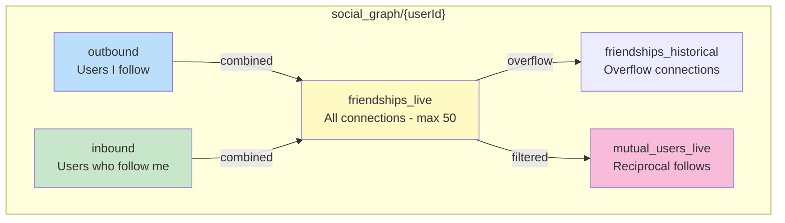
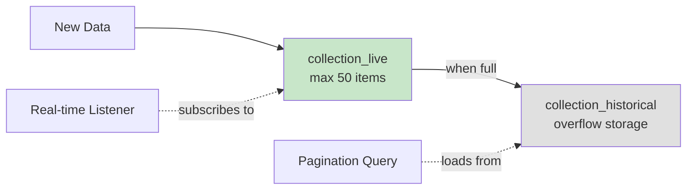
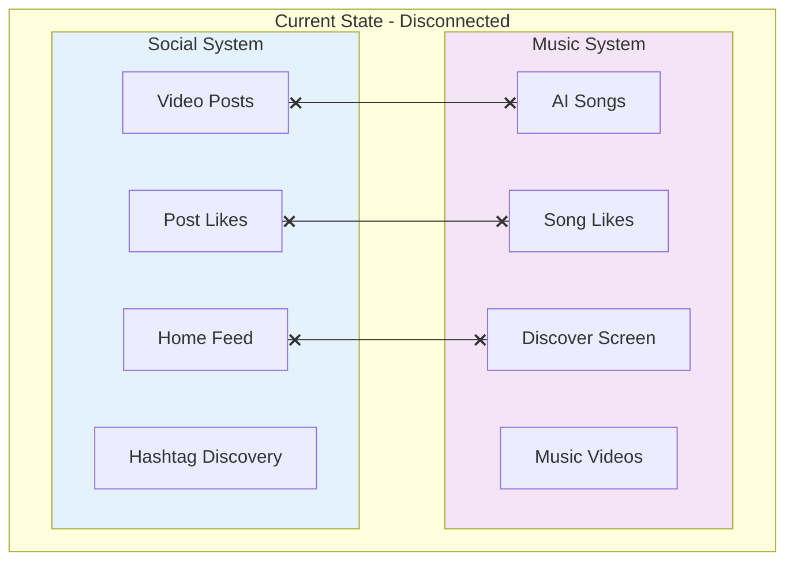
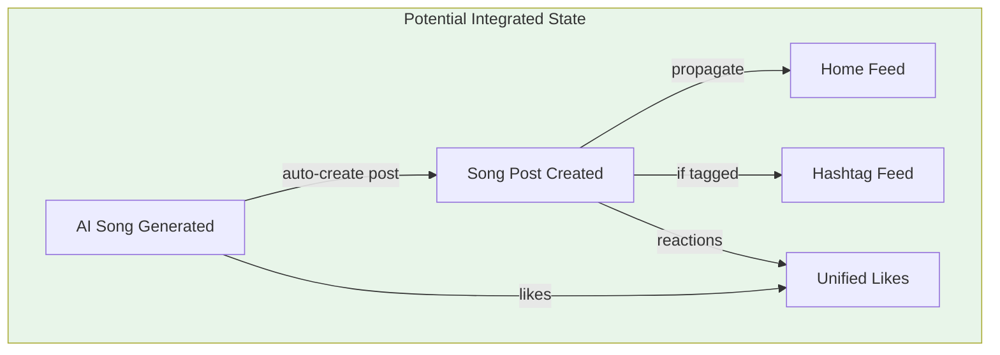
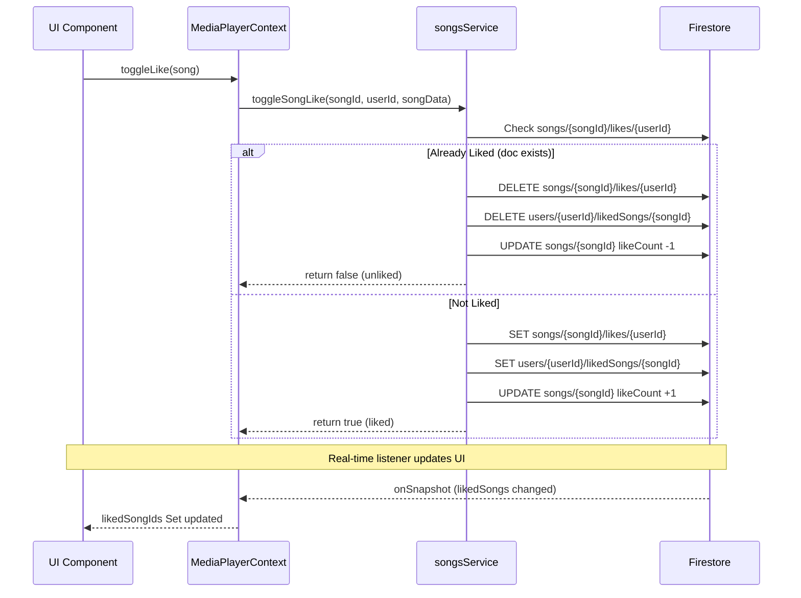

# LetsMakeMusic Data Architecture

## Overview

The app has **two parallel systems** that were built independently:

1. **Social/Feed System** (Instamobile framework) - TikTok-style video posts, followers, hashtags
2. **Music System** (custom built) - AI-generated songs, music videos, favorites

---

## Visual Architecture

```mermaid
flowchart TB
    subgraph Users["Users Collection"]
        U[users/{userId}]
        UL[users/{userId}/likedSongs]
    end

    subgraph Social["Social System"]
        P[posts]

        subgraph SocialFeeds["social_feeds/{userId}"]
            MF[main_feed]
            HFL[home_feed_live]
            HFH[home_feed_historical]
        end

        subgraph SocialGraph["social_graph/{userId}"]
            OUT[outbound]
            IN[inbound]
            FL[friendships_live]
            FH[friendships_historical]
            MU[mutual_users_live]
        end

        subgraph Hashtags["hashtags/{tag}"]
            HFL2[feed_live]
            HFH2[feed_historical]
        end
    end

    subgraph Music["Music System"]
        S[songs]
        V[videos]
    end

    %% Relationships
    U -->|"creates"| P
    U -->|"generates"| S
    S -->|"generates"| V

    P -->|"propagates to followers"| MF
    MF -->|"processed into"| HFL
    HFL -->|"overflow"| HFH

    P -->|"tagged posts"| HFL2
    HFL2 -->|"overflow"| HFH2

    U -->|"follows"| OUT
    U -->|"followed by"| IN
    OUT & IN -->|"combined"| FL
    FL -->|"overflow"| FH
    FL -->|"mutual only"| MU

    U -->|"likes songs"| UL
    P -->|"reactions stored in"| P

    %% Styling
    style Social fill:#e3f2fd,stroke:#1976d2
    style Music fill:#f3e5f5,stroke:#7b1fa2
    style Users fill:#e8f5e9,stroke:#388e3c
```

---

## Collections Breakdown

### Posts (`posts` collection)

Social media posts (text, images, TikTok-style videos) - NOT AI-generated music videos.

| Field | Type | Description |
|-------|------|-------------|
| `authorID` | string | User who created the post |
| `postText` | string | Post caption/text |
| `postMedia[]` | array | Media attachments (images/videos) |
| `hashtags[]` | array | Hashtags in the post |
| `commentCount` | number | Number of comments |
| `reactionsCount` | number | Total reaction count |
| `reactions` | map | `{ [userId]: true }` - who liked it |

### Songs (`songs` collection)

AI-generated music from Suno API.

| Field | Type | Description |
|-------|------|-------------|
| `title` | string | Song title |
| `audioUrl` | string | URL to audio file |
| `imageUrl` | string | Album art URL |
| `videoUrl` | string | Generated music video URL (if exists) |
| `style` | string | Music style/genre |
| `authorID` | string | User who generated the song |
| `sunoId` | string | Suno API reference ID |

### Videos (`videos` collection)

Generated music videos from songs.

| Field | Type | Description |
|-------|------|-------------|
| `songId` | string | Reference to source song |
| `videoUrl` | string | URL to video file |
| `title` | string | Video title |
| `authorID` | string | User who owns the video |

---

## Likes System (Two Separate Systems!)

```mermaid
flowchart LR
    subgraph PostLikes["Post Likes"]
        P[posts/{postId}]
        PR[reactions dict]
        P -->|"contains"| PR
        PR -->|"{ userId: true }"| PR
    end

    subgraph SongLikes["Song Likes"]
        U[users/{userId}]
        LS[likedSongs subcollection]
        SD[{songId} document]
        U -->|"has"| LS
        LS -->|"contains"| SD
    end

    style PostLikes fill:#fff3e0,stroke:#f57c00
    style SongLikes fill:#e8f5e9,stroke:#43a047
```

| Type | Storage Location | Structure |
|------|------------------|-----------|
| **Post likes** | `posts/{postId}.reactions` | Dictionary: `{ [userId]: true }` |
| **Song likes** | `users/{userId}/likedSongs/{songId}` | Document per liked song |

**Key insight**: Post reactions are stored ON the post (denormalized for fast read). Song likes are stored on the USER (allows easy "show my favorites" query).

---

## Feed Collections

```mermaid
flowchart TD
    subgraph FeedFlow["Feed Propagation Flow"]
        NP[New Post Created]
        MF[main_feed]
        HFL[home_feed_live]
        HFH[home_feed_historical]

        NP -->|"1. copied to followers"| MF
        MF -->|"2. processed"| HFL
        HFL -->|"3. overflow > 50"| HFH
    end

    subgraph HashtagFlow["Hashtag Feed Flow"]
        HP[Post with #hashtag]
        TFL[hashtags/{tag}/feed_live]
        TFH[hashtags/{tag}/feed_historical]

        HP -->|"1. indexed"| TFL
        TFL -->|"2. overflow > 50"| TFH
    end
```

### social_feeds/{userId}/main_feed
- **Purpose**: Processing/staging collection
- Used during feed propagation when someone posts
- Posts get copied here first, then to home_feed_live

### social_feeds/{userId}/home_feed_live
- **Purpose**: Real-time feed for the user's home screen
- **Max 50 items** - older items overflow to `home_feed_historical`
- Contains denormalized post data for fast loading
- Populated by posts from users you follow

### hashtags/{hashtag}/feed_live
- **Purpose**: Real-time feed of posts with that hashtag
- **Max 50 items** - older items overflow to `feed_historical`
- Used for hashtag discovery/trending pages

---

## Social Graph Collections



All under `social_graph/{userId}/`:

| Subcollection | Purpose | Example |
|---------------|---------|---------|
| **outbound** | Users I follow | My following list |
| **inbound** | Users who follow me | My followers list |
| **friendships_live** | All connections (combined view) | Real-time, max 50 |
| **friendships_historical** | Overflow from friendships_live | Older connections |
| **mutual_users_live** | Reciprocal follows (both directions) | "Friends" |

---

## The Live/Historical Pattern



This pattern optimizes Firestore real-time listeners:
- `_live` collections stay small for fast real-time updates
- `_historical` collections store older data, loaded on-demand with pagination

**Used in:**
- `home_feed_live` / `home_feed_historical`
- `feed_live` / `feed_historical` (hashtags)
- `friendships_live` / `friendships_historical`
- `mutual_users_live`

---

## Integration Gap

**Current state**: Music and Social systems are disconnected.



| Feature | Social System | Music System |
|---------|---------------|--------------|
| Content | Video posts | AI songs/videos |
| Likes | `posts.reactions` | `users.likedSongs` |
| Feed | `home_feed_live` | None (songs not in feed) |
| Discovery | Hashtag feeds | Discover screen only |

**The "Videos" tab on Feed is empty** because:
- It filters `posts` for video media type
- No social video posts exist yet
- AI-generated music videos are in `videos` collection, not `posts`

---

## Potential Integration Points

If you wanted to unify these systems:



1. **Post AI songs to feed** - Create a post when generating a song, linking to `songs/{songId}`
2. **Unified likes** - Either migrate song likes to post reactions, or keep separate with sync
3. **Music in hashtag feeds** - Allow songs to have hashtags and appear in hashtag feeds
4. **Social sharing** - "Share to feed" button on songs

---

## Quick Reference: Collection Paths

```
Firestore Database
├── users/{userId}
│   └── likedSongs/{songId}          # Song likes
├── posts/{postId}                    # Social posts (reactions inside)
├── songs/{songId}                    # AI-generated songs
├── videos/{videoId}                  # Generated music videos
├── social_feeds/{userId}
│   ├── main_feed/{docId}            # Processing stage
│   ├── home_feed_live/{docId}       # Real-time feed (max 50)
│   └── home_feed_historical/{docId}  # Overflow
├── social_graph/{userId}
│   ├── outbound/{followedUserId}    # Who I follow
│   ├── inbound/{followerUserId}     # Who follows me
│   ├── friendships_live/{docId}     # Combined (max 50)
│   ├── friendships_historical/{docId} # Overflow
│   └── mutual_users_live/{docId}    # Reciprocal
└── hashtags/{hashtag}
    ├── feed_live/{docId}            # Tagged posts (max 50)
    └── feed_historical/{docId}      # Overflow
```

---

# Deep Dive: Document Structures

## Songs Collection - Full Schema

**Source:** [songsService.js:36-121](ReactNativeTikTokApp/src/services/songsService.js#L36-L121)

```javascript
songs/{songId} = {
  // === User Info ===
  userId: string,
  author: {
    id: string,
    stageName: string,
    bio: string,
    profilePictureURL: string,
    firstName: string,
    lastName: string,
  },

  // === Suno API Data ===
  sunoId: string,                    // Original Suno reference
  audioUrl: string,                  // Suno-hosted audio (expires!)
  streamUrl: string,                 // Suno stream URL
  imageUrl: string,                  // Album artwork
  videoUrl: string,                  // Suno-hosted video (expires!)
  firebaseAudioUrl: string,          // Permanent Firebase copy
  firebaseVideoUrl: string,          // Permanent Firebase copy

  // === Video Metadata ===
  videoMetadata: {
    duration: number,
    resolution: string,
    fileSize: number,
    thumbnailUrl: string,
    createdAt: timestamp,
    expiresAt: timestamp,
    taskId: string,
  },
  videoGenerationStatus: 'pending' | 'generating' | 'complete' | 'failed',
  videoTaskId: string,

  // === Song Metadata ===
  title: string,
  style: string,                     // Genre/style tags
  duration: number,                  // In seconds

  // === Lyrics ===
  rawLyrics: string,
  timestampedLyrics: [
    { text: string, startTime: number, endTime: number }
  ],

  // === Generation Info ===
  model: string,                     // 'V4', 'V5', etc.
  instrumental: boolean,
  prompt: string,                    // Original generation prompt

  // === Timestamps ===
  createdAt: serverTimestamp,
  updatedAt: serverTimestamp,

  // === Stats (Counters) ===
  playCount: number,                 // FieldValue.increment()
  likeCount: number,                 // FieldValue.increment()
  shareCount: number,                // FieldValue.increment()

  // === Visibility ===
  isPublic: boolean,
  isDeleted: boolean,

  // === Suno Availability ===
  sunoAudioAvailable: boolean,       // Track if Suno URLs expired
  sunoTaskId: string,
}
```

## Songs Subcollections

```javascript
// Who liked this song (for counting/querying)
songs/{songId}/likes/{userId} = {
  likedAt: serverTimestamp,
}

// User's created songs (quick reference)
users/{userId}/songs/{songId} = {
  songId: string,
  title: string,
  imageUrl: string,
  duration: number,
  createdAt: serverTimestamp,
}

// User's liked songs (for "My Favorites" screen)
users/{userId}/likedSongs/{songId} = {
  songId: string,
  title: string,
  imageUrl: string,
  artist: string,
  likedAt: serverTimestamp,
}
```

## Posts Collection - Full Schema

**Source:** [feedRef.js](ReactNativeTikTokApp/src/core/socialgraph/feed/api/firebase/feedRef.js)

```javascript
posts/{postId} = {
  id: string,
  authorID: string,

  // Content
  postText: string,
  postMedia: [
    {
      url: string,
      type: 'image' | 'video',
      thumbnailURL: string,
    }
  ],

  // Metadata
  hashtags: string[],
  location: object,
  createdAt: timestamp,

  // Engagement (denormalized for fast reads)
  commentCount: number,
  reactionsCount: number,
  reactions: {
    [userId]: boolean,              // true = liked
  },

  // Author info (denormalized)
  author: {
    id: string,
    firstName: string,
    lastName: string,
    profilePictureURL: string,
  },
}
```

---

# Deep Dive: Likes Code Flow

## Song Likes Architecture



## Key Functions

### toggleSongLike()

**Location:** [songsService.js:588-630](ReactNativeTikTokApp/src/services/songsService.js#L588-L630)

```javascript
export const toggleSongLike = async (songId, userId, songData = {}) => {
  const likeDoc = await songLikesRef(songId).doc(userId).get()
  const docExists = likeDoc.exists

  if (docExists) {
    // UNLIKE: Parallel deletes + decrement
    await Promise.all([
      songLikesRef(songId).doc(userId).delete(),
      userLikedSongsRef(userId).doc(songId).delete(),
      songsRef.doc(songId).update({
        likeCount: FieldValue.increment(-1),
      }),
    ])
    return false
  } else {
    // LIKE: Parallel writes + increment
    await Promise.all([
      songLikesRef(songId).doc(userId).set({ likedAt: now }),
      userLikedSongsRef(userId).doc(songId).set({
        songId,
        title: songData.title || '',
        imageUrl: songData.imageUrl || null,
        artist: songData.artist || '',
        likedAt: now,
      }),
      songsRef.doc(songId).update({
        likeCount: FieldValue.increment(1),
      }),
    ])
    return true
  }
}
```

### subscribeToLikedSongs() - Real-time Sync

**Location:** [songsService.js:660-674](ReactNativeTikTokApp/src/services/songsService.js#L660-L674)

```javascript
export const subscribeToLikedSongs = (userId, callback) => {
  return userLikedSongsRef(userId).onSnapshot(
    (querySnapshot) => {
      const likedSongIds = new Set()
      querySnapshot?.docs?.forEach(doc => {
        likedSongIds.add(doc.id)  // doc.id is songId
      })
      callback(likedSongIds)
    },
    (error) => {
      console.error('Error subscribing to liked songs:', error)
      callback(new Set())
    }
  )
}
```

### MediaPlayerContext Integration

**Location:** [MediaPlayerContext.js:23-83, 503-549](ReactNativeTikTokApp/src/contexts/MediaPlayerContext.js)

```javascript
// State
const [likedSongIds, setLikedSongIds] = useState(new Set())

// Subscribe on mount
useEffect(() => {
  if (!userId) return

  const unsubscribe = subscribeToLikedSongs(userId, (likedIds) => {
    setLikedSongIds(likedIds)  // Shared state across all components
  })

  return () => unsubscribe()
}, [userId])

// Check if song is liked
const isLiked = useCallback((songId) => {
  return likedSongIds.has(songId)
}, [likedSongIds])

// Toggle like
const toggleLike = useCallback(async (song) => {
  if (!song?.id || !userId) return
  await toggleSongLike(song.id, userId, song)
}, [userId])
```

## Post Likes (Reactions) - Different System!

**Location:** [useReactions.js](ReactNativeTikTokApp/src/core/socialgraph/feed/api/firebase/useReactions.js)

Post likes use cloud functions and store reactions directly on the post document:

```javascript
// Adding a reaction to a post
export const addReaction = async (postID, authorID, reaction) => {
  const instance = FeedFunctions().addReaction  // Cloud function
  const res = await instance({
    authorID,
    postID,
    reaction,  // e.g., 'like', 'love', etc.
  })
  return res?.data
}
```

**Key Difference:**
- **Songs**: Client-side writes to subcollections + counter increment
- **Posts**: Server-side cloud function updates reactions map

---

# Deep Dive: Feed Propagation

## Feed Distribution Architecture

```mermaid
flowchart TB
    subgraph Creation["Post Creation"]
        UP[User Posts]
        CF[addPost Cloud Function]
        UP -->|"calls"| CF
    end

    subgraph Storage["Primary Storage"]
        PC[posts/{postId}]
        CF -->|"1. writes"| PC
    end

    subgraph AuthorFeed["Author's Feeds"]
        APF[profile_feed_live]
        AMF[main_feed]
        CF -->|"2. copies to"| APF
        CF -->|"2. copies to"| AMF
    end

    subgraph FollowerFeeds["Follower Distribution"]
        SG[social_graph/{authorId}/inbound]
        FF[Each follower's main_feed]
        CF -->|"3. reads"| SG
        SG -->|"4. fanout write"| FF
    end

    subgraph Hashtags["Hashtag Indexing"]
        HT[hashtags/{tag}/feed_live]
        CF -->|"5. if tagged"| HT
    end

    style Creation fill:#e3f2fd
    style Storage fill:#fff3e0
    style AuthorFeed fill:#e8f5e9
    style FollowerFeeds fill:#fce4ec
    style Hashtags fill:#f3e5f5
```

## Feed Hydration on Follow

**Location:** [firebaseFeedClient.js:310-329](ReactNativeTikTokApp/src/core/socialgraph/feed/api/firebase/firebaseFeedClient.js#L310-L329)

When User A follows User B, all of B's posts are copied to A's feed:

```javascript
export const hydrateFeedForNewFriendship = async (destUserID, sourceUserID) => {
  const mainFeedDestRef = DocRef(destUserID).mainFeed

  // Get all posts from the person we just followed
  const unsubscribe = postsRef
    .where('authorID', '==', sourceUserID)
    .onSnapshot((querySnapshot) => {
      querySnapshot?.forEach(doc => {
        const post = doc.data()
        if (post.id) {
          // FANOUT: Copy post to our feed
          mainFeedDestRef.doc(post.id).set(post)
        }
      })
      unsubscribe()
    })
}
```

## Feed Cleanup on Unfollow

**Location:** [firebaseFeedClient.js:331-351](ReactNativeTikTokApp/src/core/socialgraph/feed/api/firebase/firebaseFeedClient.js#L331-L351)

When User A unfollows User B, B's posts are removed from A's feed:

```javascript
export const removeFeedForOldFriendship = async (destUserID, oldFriendID) => {
  const mainFeedDestRef = DocRef(destUserID).mainFeed

  // Find all posts from the unfollowed person
  const unsubscribe = postsRef
    .where('authorID', '==', oldFriendID)
    .onSnapshot((querySnapshot) => {
      querySnapshot?.forEach(doc => {
        const post = doc.data()
        if (post.id) {
          // REMOVAL: Delete from our feed
          mainFeedDestRef.doc(post.id).delete()
        }
      })
      unsubscribe()
    })
}
```

## Real-Time Feed Subscriptions

**Location:** [firebaseFeedClient.js:59-91](ReactNativeTikTokApp/src/core/socialgraph/feed/api/firebase/firebaseFeedClient.js#L59-L91)

```javascript
export const subscribeToHomeFeedPosts = (userID, callback) => {
  return DocRef(userID)
    .homeFeedLive
    .orderBy('createdAt', 'desc')
    .onSnapshot(
      { includeMetadataChanges: true },
      querySnapshot => {
        // Skip cache-only updates
        if (querySnapshot?.metadata?.fromCache === true) return

        callback(querySnapshot?.docs?.map(doc => doc.data()))
      },
      error => {
        console.log(error)
        callback([])
      }
    )
}
```

## Profile Update Propagation

**Location:** [triggers.js:11-264](firebase/functions/triggers.js#L11-L264)

Cloud function that updates denormalized author data when profile changes:

```javascript
exports.propagateUserProfileUpdates = functions.firestore
    .document('users/{userID}')
    .onUpdate(async (change, context) => {
        const before = change.before.data()
        const after = change.after.data()

        // Check if relevant fields changed
        const fieldsToWatch = ['firstName', 'lastName', 'profilePictureURL',
                               'email', 'stageName', 'bio']

        const hasChanged = fieldsToWatch.some(
            field => before[field] !== after[field]
        )

        if (hasChanged) {
            // Update all songs with new author info
            await updateSongsAuthor(context.params.userID, after)

            // Update chat conversations
            await updateChatMessages(context.params.userID, after)
        }
    })
```

---

# Debug & Diagnostic Endpoints

## debugCheckLikes

**Location:** [functions/index.js:105-180](firebase/functions/index.js#L105-L180)

```
GET /debugCheckLikes?songId={songId}&userId={userId}&action={action}

Actions:
  - findAllLikes: List all likes across all songs
  - findUserLikedSongs: Get all songs liked by a user
  - (default): Check specific song/user like status

Returns:
  {
    songExists: boolean,
    likeCount: number,
    likesSubcollection: [{ userId, likedAt }],
    userLikedSong: { exists, data }
  }
```

## diagnoseSongsForVideo

```
GET /diagnoseSongsForVideo?userId={userId}&limit={limit}

Returns songs that are ready for video generation:
  - Has audioUrl
  - No existing videoUrl
  - videoGenerationStatus not 'generating'
```

---

# Architectural Patterns Summary

| Pattern | Description | Used In |
|---------|-------------|---------|
| **Fanout Write** | 1 write → N copies to followers | Feed propagation |
| **Denormalization** | Author info copied to documents | Songs, Posts |
| **Live/Historical Split** | Max 50 in _live, overflow to _historical | Feeds, Social Graph |
| **Dual Storage** | Store on both entity and user | Song likes |
| **Optimistic Updates** | UI updates before server confirms | Reactions |
| **Counter Increment** | FieldValue.increment() | Like counts, Play counts |
| **Cloud Triggers** | Firestore triggers propagate changes | Profile updates |

---

*Last updated: December 2024*
