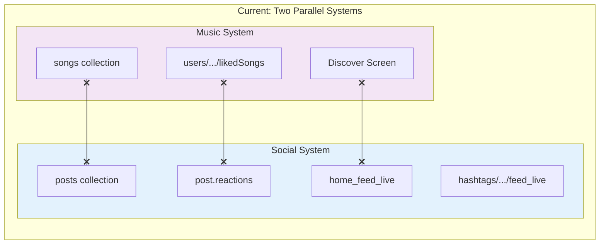
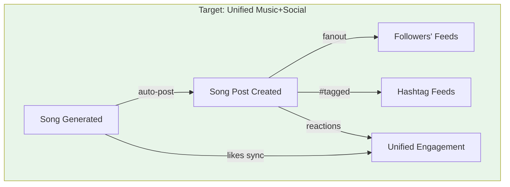
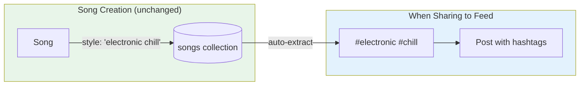
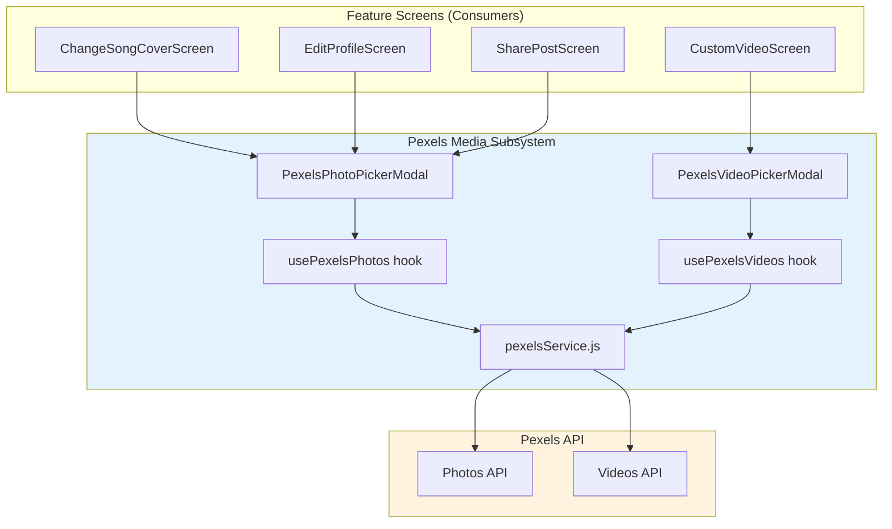
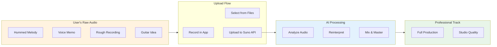
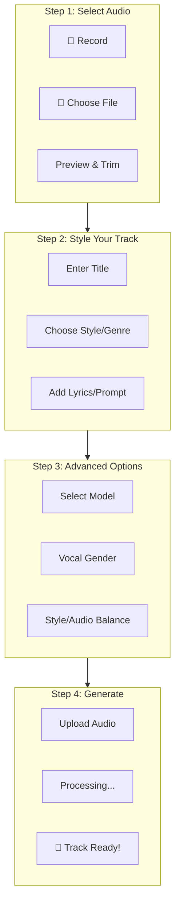
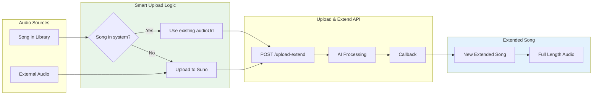

# Music-Social Integration Phases

## Source Documentation & APIs

| Resource | URL |
|----------|-----|
| **Pexels API** | https://www.pexels.com/api/documentation/ |
| **Firebase Functions** | https://firebase.google.com/docs/functions |
| **Firebase Firestore** | https://firebase.google.com/docs/firestore |
| **Firebase Storage** | https://firebase.google.com/docs/storage |
| **React Native** | https://reactnative.dev/docs/getting-started |
| **React Navigation** | https://reactnavigation.org/docs/getting-started |
| **Lucide Icons (React Native)** | https://lucide.dev/guide/packages/lucide-react-native |
| **Suno API** | https://sunoapi.org |
| **Instamobile Docs** | https://instamobile.io/docs/getting-started-with-react-native |

---

## Goal

Integrate the **Music System** (AI-generated songs) with the **Social System** (posts, feeds, hashtags) so that:
- Songs appear in followers' feeds
- Songs can be discovered via hashtags
- Users can share songs to their feed
- Likes work consistently across both systems

---

## Current State



---

## Target State



---

# Phase 1: Song Post Creation

**Goal:** When a song is generated, optionally create a post that links to it.

## 1.1 Data Model Changes

### Implementation Checklist
- [x] Add `postType` field to post schema
- [x] Add `linkedSongId` field to post schema
- [x] Add `songData` denormalized object to post schema
- [x] Verify existing posts without `postType` treated as `'standard'`

### New Post Type: `songPost`

Add to post schema:
```javascript
posts/{postId} = {
  // Existing fields...
  id: string,
  authorID: string,
  postText: string,
  createdAt: timestamp,

  // NEW: Song link
  postType: 'standard' | 'song',  // NEW FIELD
  linkedSongId: string,           // Reference to songs/{songId}

  // Song metadata (denormalized for feed display)
  songData: {
    title: string,
    imageUrl: string,
    audioUrl: string,
    videoUrl: string,
    style: string,
    duration: number,
  },
}
```

### Migration Strategy
- **No migration needed** - new posts get new fields
- Existing posts without `postType` are treated as `'standard'`

## 1.2 Cloud Function: `createSongPost`

### Implementation Checklist
- [x] Create `firebase/functions/songs/createSongPost.js`
- [x] Implement authentication check
- [x] Implement song data retrieval
- [x] Implement post creation with songData
- [x] Update song with linkedPostId reference
- [x] Export function in `firebase/functions/index.js`
- [x] Deploy and test

**Location:** `firebase/functions/songs/createSongPost.js`

```javascript
exports.createSongPost = functions.https.onCall(async (data, context) => {
  const { songId, caption, hashtags, visibility } = data
  const userId = context.auth.uid

  // 1. Get song data
  const songDoc = await db.collection('songs').doc(songId).get()
  const song = songDoc.data()

  // 2. Create post
  const postRef = db.collection('posts').doc()
  const post = {
    id: postRef.id,
    authorID: userId,
    postType: 'song',
    linkedSongId: songId,
    postText: caption || `Check out my new song: ${song.title}`,
    hashtags: hashtags || [],
    createdAt: admin.firestore.FieldValue.serverTimestamp(),

    // Denormalized song data
    songData: {
      title: song.title,
      imageUrl: song.imageUrl,
      audioUrl: song.firebaseAudioUrl || song.audioUrl,
      videoUrl: song.firebaseVideoUrl || song.videoUrl,
      style: song.style,
      duration: song.duration,
    },

    // Author info (denormalized)
    author: song.author,

    // Engagement counters
    commentCount: 0,
    reactionsCount: 0,
    reactions: {},
  }

  await postRef.set(post)

  // 3. Update song with post reference
  await db.collection('songs').doc(songId).update({
    linkedPostId: postRef.id,
    isPublic: visibility !== 'private',
  })

  return { postId: postRef.id }
})
```

## 1.3 UI Changes

### Implementation Checklist
- [x] Decide on Option A (auto-post) or Option B (manual) → **Both options implemented!**
- [x] Implement Option B (manual) → ShareSongToFeedScreen + SongActionMenu
- [x] Implement Option A (auto) → User setting `auto_share_to_feed` in Settings

### Option A: Auto-post on Generate ✅ IMPLEMENTED
Users can enable "Auto-share to Feed" in Settings → Song Creation.
When enabled, songs are automatically shared after generation in:
- `CreateScreen.js` - New song generation
- `GenerationTaskContext.js` - Extended songs

User setting stored as: `user.auto_share_to_feed` (boolean, default: false)

Config field added to `src/config/index.js`:
```javascript
{
  title: localized('Song Creation'),
  fields: [{
    displayName: localized('Auto-share to Feed'),
    type: 'switch',
    editable: true,
    key: 'auto_share_to_feed',
    value: false,
  }],
}
```

### Option B: Manual "Share to Feed" Button ✅ IMPLEMENTED
Add to `SongActionMenu`:
```javascript
{
  icon: Share2,
  label: 'Share to Feed',
  onPress: () => navigation.navigate('ShareSongToFeed', { song }),
}
```

**Result:** Users have full control - auto OR manual sharing, their choice!

## 1.4 Files to Create/Modify

| File | Action | Status | Description |
|------|--------|--------|-------------|
| `firebase/functions/songs/createSongPost.js` | Create | [x] | Cloud function |
| `firebase/functions/index.js` | Modify | [x] | Export new function |
| `src/screens/ShareSongToFeedScreen.js` | Create | [x] | Share UI |
| `src/components/ui/SongActionMenu/index.js` | Modify | [x] | Add share option |
| `src/navigators/MainStackNavigator.js` | Modify | [x] | Add route |

## 1.5 Testing Checklist

- [ ] Create song post manually
- [ ] Post appears in author's profile_feed_live
- [ ] Post includes correct song metadata
- [ ] Song document has linkedPostId reference
- [ ] Post type correctly set to 'song'

---

# Phase 2: Feed Integration

**Goal:** Song posts appear in followers' feeds and can be played inline.

## 2.1 Feed Propagation

### Implementation Checklist
- [ ] Verify existing `addPost` function handles song posts
- [ ] Test fanout to followers' feeds

Song posts use existing feed infrastructure - no changes needed to propagation logic!

The existing `addPost` cloud function handles:
1. Writing to `posts` collection
2. Copying to author's feeds
3. Fanout to followers' `main_feed`

**Key insight:** Since song posts ARE posts, they automatically flow through the feed system.

## 2.2 Feed UI: Song Post Renderer

### Implementation Checklist
- [ ] Create `SongPostCard` component
- [ ] Create `PostHeader` sub-component (or reuse existing)
- [ ] Create `PostEngagement` sub-component (or reuse existing)
- [ ] Implement album art display
- [ ] Implement play button

### New Component: `SongPostCard`

**Location:** `src/components/ui/SongPostCard/index.js`

```javascript
const SongPostCard = ({ post, onPlay, onLike, onComment }) => {
  const { songData, author, postText } = post

  return (
    <View style={styles.container}>
      {/* Author header */}
      <PostHeader author={author} createdAt={post.createdAt} />

      {/* Caption */}
      {postText && <Text style={styles.caption}>{postText}</Text>}

      {/* Song player card */}
      <TouchableOpacity onPress={() => onPlay(songData)} style={styles.songCard}>
        <Image source={{ uri: songData.imageUrl }} style={styles.albumArt} />
        <View style={styles.songInfo}>
          <Text style={styles.title}>{songData.title}</Text>
          <Text style={styles.style}>{songData.style}</Text>
        </View>
        <PlayButton />
      </TouchableOpacity>

      {/* Engagement bar */}
      <PostEngagement
        reactions={post.reactionsCount}
        comments={post.commentCount}
        onLike={onLike}
        onComment={onComment}
      />
    </View>
  )
}
```

### Modify Feed Renderer

In `FeedItem.js` or equivalent:
```javascript
const renderPost = (post) => {
  if (post.postType === 'song') {
    return <SongPostCard post={post} onPlay={handlePlaySong} />
  }
  return <StandardPostCard post={post} />
}
```

## 2.3 Inline Playback

### Implementation Checklist
- [ ] Integrate MediaPlayerContext with feed
- [ ] Implement handlePlaySong function
- [ ] Test playback from feed items

When user taps song in feed:
```javascript
const handlePlaySong = (songData) => {
  // Use MediaPlayerContext
  playSong({
    id: post.linkedSongId,
    title: songData.title,
    audioUrl: songData.audioUrl,
    imageUrl: songData.imageUrl,
  })
}
```

## 2.4 Files to Create/Modify

| File | Action | Status | Description |
|------|--------|--------|-------------|
| `src/components/ui/SongPostCard/index.js` | Create | [ ] | Song post renderer |
| `src/core/socialgraph/feed/ui/FeedItem.js` | Modify | [ ] | Route to SongPostCard |
| `src/core/socialgraph/feed/ui/Feed.js` | Modify | [ ] | Handle song play |

## 2.5 Testing Checklist

- [ ] Song posts appear in author's feed
- [ ] Song posts appear in followers' feeds after follow
- [ ] Tapping song starts playback via MiniPlayer
- [ ] Album art and metadata display correctly
- [ ] Caption/hashtags render properly

---

# Phase 3: Hashtag Strategy

**Goal:** Songs are discoverable via hashtags WITHOUT adding complexity to song creation.

## Key Decision: Hashtags on Posts, Not Songs

**Rationale:** Users should focus on making music, not managing metadata. Hashtags are a social discovery feature - they belong on posts, not songs.



---

## Phase 3.1: No Hashtags on Songs

### Implementation Checklist
- [x] Decision made: Songs do NOT get a `hashtags` field
- [x] No schema change needed

**Decision:** Songs do NOT get a `hashtags` field. No schema change to songs collection.

**Why this matters:**
- Simpler song creation flow
- No migration needed
- Users don't need to think about hashtags when generating music
- Hashtags are social metadata, not music metadata

**Implementation:** Nothing to do! The song schema stays as-is.

---

## Phase 3.2: Auto-Generate Hashtags from Style

**When:** User shares song to feed via `createSongPost`

**How:** Extract hashtags automatically from `song.style` field.

### Implementation Checklist
- [x] Add `autoGenerateHashtags()` to createSongPost cloud function
- [x] Merge style hashtags with caption hashtags
- [x] Dedupe merged hashtags
- [x] Return generated hashtags in response

### Cloud Function Update

In `firebase/functions/songs/createSongPost.js`:

```javascript
/**
 * Auto-generate hashtags from song style
 * "electronic chill pop" → ['#electronic', '#chill', '#pop']
 */
const autoGenerateHashtags = (style) => {
  if (!style) return []

  return style
    .split(/[\s,]+/)                          // Split on spaces/commas
    .map(s => s.toLowerCase())                 // Lowercase
    .map(s => s.replace(/[^a-z0-9]/g, ''))    // Remove special chars
    .filter(s => s.length > 2)                 // Min 3 chars
    .map(s => `#${s}`)                         // Add hash prefix
    .slice(0, 5)                               // Max 5 hashtags
}

exports.createSongPost = functions.https.onCall(async (data, context) => {
  const { songId, caption } = data
  const userId = context.auth.uid

  // Get song data
  const songDoc = await db.collection('songs').doc(songId).get()
  const song = songDoc.data()

  // AUTO-GENERATE hashtags from style
  const styleHashtags = autoGenerateHashtags(song.style)

  // Extract any hashtags from caption (user typed #party etc)
  const captionHashtags = (caption?.match(/#\w+/g) || [])
    .map(t => t.toLowerCase())

  // Merge and dedupe
  const allHashtags = [...new Set([...styleHashtags, ...captionHashtags])]

  // Create post with auto-generated hashtags
  const post = {
    // ... other fields ...
    hashtags: allHashtags,
    // ...
  }

  await postRef.set(post)
  return { postId: postRef.id, hashtags: allHashtags }
})
```

### Example Flow

| Song Style | Auto Hashtags |
|------------|---------------|
| `"electronic chill"` | `#electronic`, `#chill` |
| `"hip-hop, trap, bass"` | `#hiphop`, `#trap`, `#bass` |
| `"acoustic folk singer-songwriter"` | `#acoustic`, `#folk`, `#singersongwriter` |
| `"lo-fi study beats"` | `#lofi`, `#study`, `#beats` |

### UI Feedback

In `ShareSongToFeedScreen`, show the auto-generated hashtags:

```javascript
const ShareSongToFeedScreen = ({ route }) => {
  const { song } = route.params

  // Show what hashtags will be auto-generated
  const previewHashtags = autoGenerateHashtags(song.style)

  return (
    <View>
      {/* Song preview */}
      <SongPreviewCard song={song} />

      {/* Caption input */}
      <TextInput
        placeholder="Write a caption... (use #hashtags for more)"
        value={caption}
        onChangeText={setCaption}
      />

      {/* Auto-generated hashtags preview */}
      <View style={styles.hashtagPreview}>
        <Text style={styles.hashtagLabel}>Auto-tagged from style:</Text>
        <View style={styles.hashtagRow}>
          {previewHashtags.map(tag => (
            <Text key={tag} style={styles.hashtag}>{tag}</Text>
          ))}
        </View>
        <Text style={styles.hashtagHint}>
          Add more in your caption with #
        </Text>
      </View>

      <ShareButton onPress={handleShare} />
    </View>
  )
}
```

---

## Phase 3.3: Hashtag Editing UI

**Goal:** Allow users to add, remove, and edit hashtags when sharing songs to feed.

### 3.3.1 HashtagChips Component

### Implementation Checklist
- [x] Create `HashtagChips` component
- [x] Implement add tag functionality
- [x] Implement remove tag functionality
- [x] Implement auto-format (lowercase, # prefix)
- [x] Implement max tags limit
- [x] Implement tag count display
- [x] Support dark/light theme

**Location:** `src/components/ui/HashtagChips/index.js`

Reusable component for displaying and editing hashtag lists:

```javascript
import React, { useState, useCallback } from 'react'
import { View, Text, TextInput, TouchableOpacity, StyleSheet } from 'react-native'
import { X, Plus } from 'lucide-react-native'

const HashtagChips = ({
  tags = [],
  onRemove,
  onAdd,
  editable = true,
  maxTags = 10,
  placeholder = 'Add hashtag...',
}) => {
  const [inputValue, setInputValue] = useState('')

  const handleAdd = useCallback(() => {
    if (!inputValue.trim() || tags.length >= maxTags) return

    // Clean and format hashtag
    let tag = inputValue.trim().toLowerCase()
    if (!tag.startsWith('#')) tag = `#${tag}`
    tag = tag.replace(/[^#a-z0-9]/g, '')

    if (tag.length > 1 && !tags.includes(tag)) {
      onAdd?.(tag)
      setInputValue('')
    }
  }, [inputValue, tags, maxTags, onAdd])

  return (
    <View style={styles.container}>
      {/* Existing tags */}
      <View style={styles.tagsRow}>
        {tags.map((tag) => (
          <View key={tag} style={styles.chip}>
            <Text style={styles.chipText}>{tag}</Text>
            {editable && (
              <TouchableOpacity onPress={() => onRemove?.(tag)} style={styles.removeBtn}>
                <X size={14} color="#fff" />
              </TouchableOpacity>
            )}
          </View>
        ))}
      </View>

      {/* Add new tag input */}
      {editable && tags.length < maxTags && (
        <View style={styles.inputRow}>
          <TextInput
            style={styles.input}
            value={inputValue}
            onChangeText={setInputValue}
            placeholder={placeholder}
            onSubmitEditing={handleAdd}
            returnKeyType="done"
            autoCapitalize="none"
          />
          <TouchableOpacity onPress={handleAdd} style={styles.addBtn}>
            <Plus size={18} color="#fff" />
          </TouchableOpacity>
        </View>
      )}

      {/* Tag count */}
      <Text style={styles.count}>{tags.length}/{maxTags} tags</Text>
    </View>
  )
}

const styles = StyleSheet.create({
  container: { marginVertical: 12 },
  tagsRow: { flexDirection: 'row', flexWrap: 'wrap', gap: 8 },
  chip: {
    flexDirection: 'row',
    alignItems: 'center',
    backgroundColor: '#2126A2',
    borderRadius: 16,
    paddingHorizontal: 12,
    paddingVertical: 6,
    gap: 6,
  },
  chipText: { color: '#fff', fontSize: 14, fontWeight: '500' },
  removeBtn: { padding: 2 },
  inputRow: { flexDirection: 'row', marginTop: 12, gap: 8 },
  input: {
    flex: 1,
    borderWidth: 1,
    borderColor: '#444',
    borderRadius: 8,
    paddingHorizontal: 12,
    paddingVertical: 8,
    color: '#fff',
    backgroundColor: '#1a1a1a',
  },
  addBtn: {
    backgroundColor: '#2126A2',
    borderRadius: 8,
    padding: 10,
    justifyContent: 'center',
    alignItems: 'center',
  },
  count: { color: '#666', fontSize: 12, marginTop: 8 },
})

export default HashtagChips
```

### 3.3.2 Update ShareSongToFeedScreen

### Implementation Checklist
- [x] Integrate HashtagChips component
- [x] Auto-generate initial hashtags from style
- [x] Extract hashtags from caption as user types
- [x] Implement add/remove handlers
- [x] Merge and dedupe hashtags

Integrate HashtagChips into the share screen:

```javascript
const ShareSongToFeedScreen = ({ route }) => {
  const { song } = route.params
  const [caption, setCaption] = useState('')

  // Auto-generate initial hashtags from style
  const [hashtags, setHashtags] = useState(() => autoGenerateHashtags(song.style))

  const handleRemoveTag = useCallback((tag) => {
    setHashtags(prev => prev.filter(t => t !== tag))
  }, [])

  const handleAddTag = useCallback((tag) => {
    setHashtags(prev => [...prev, tag])
  }, [])

  // Also extract hashtags typed in caption
  useEffect(() => {
    const captionTags = caption.match(/#\w+/g) || []
    const newTags = captionTags
      .map(t => t.toLowerCase())
      .filter(t => !hashtags.includes(t))

    if (newTags.length > 0) {
      setHashtags(prev => [...new Set([...prev, ...newTags])])
    }
  }, [caption])

  return (
    <SafeAreaView style={styles.container}>
      <SongPreviewCard song={song} />

      <TextInput
        placeholder="Write a caption..."
        value={caption}
        onChangeText={setCaption}
        multiline
        style={styles.captionInput}
      />

      {/* Editable hashtag chips */}
      <Text style={styles.sectionLabel}>Hashtags</Text>
      <HashtagChips
        tags={hashtags}
        onRemove={handleRemoveTag}
        onAdd={handleAddTag}
        maxTags={10}
      />

      <ShareButton
        onPress={() => handleShare(song.id, caption, hashtags)}
      />
    </SafeAreaView>
  )
}
```

### 3.3.3 Hashtag Suggestions

### Implementation Checklist
- [ ] Create `HashtagSuggestions` component
- [ ] Implement style-based suggestion matching
- [ ] Implement suggestion chip UI
- [ ] Filter out already-selected tags

Add suggested hashtags based on song style:

```javascript
const MUSIC_HASHTAG_SUGGESTIONS = {
  electronic: ['#edm', '#synth', '#beats', '#dance'],
  hiphop: ['#rap', '#bars', '#flow', '#urban'],
  pop: ['#catchy', '#mainstream', '#radio'],
  rock: ['#guitar', '#band', '#live'],
  chill: ['#relax', '#vibes', '#ambient', '#lofi'],
  study: ['#focus', '#productivity', '#background'],
  workout: ['#gym', '#motivation', '#energy'],
}

const HashtagSuggestions = ({ style, currentTags, onSelect }) => {
  // Find matching suggestions based on style words
  const suggestions = useMemo(() => {
    const styleWords = style?.toLowerCase().split(/[\s,]+/) || []
    const allSuggestions = new Set()

    styleWords.forEach(word => {
      const matches = MUSIC_HASHTAG_SUGGESTIONS[word] || []
      matches.forEach(tag => {
        if (!currentTags.includes(tag)) {
          allSuggestions.add(tag)
        }
      })
    })

    // Add general music tags
    ['#newmusic', '#aimusic', '#original'].forEach(tag => {
      if (!currentTags.includes(tag)) allSuggestions.add(tag)
    })

    return Array.from(allSuggestions).slice(0, 8)
  }, [style, currentTags])

  return (
    <View style={styles.suggestions}>
      <Text style={styles.label}>Suggested:</Text>
      <ScrollView horizontal showsHorizontalScrollIndicator={false}>
        {suggestions.map(tag => (
          <TouchableOpacity
            key={tag}
            style={styles.suggestionChip}
            onPress={() => onSelect(tag)}
          >
            <Text style={styles.suggestionText}>{tag}</Text>
          </TouchableOpacity>
        ))}
      </ScrollView>
    </View>
  )
}
```

### 3.3.4 Files to Create/Modify

| File | Action | Status | Description |
|------|--------|--------|-------------|
| `src/components/ui/HashtagChips/index.js` | Create | [x] | Reusable hashtag chip component |
| `src/components/ui/HashtagSuggestions/index.js` | Create | [ ] | Suggestion component |
| `src/screens/ShareSongToFeedScreen.js` | Modify | [x] | Integrate hashtag editing |
| `src/components/index.js` | Modify | [ ] | Export new components |

### 3.3.5 Testing Checklist

- [x] Auto-generated hashtags appear as removable chips
- [x] Tap X on chip removes hashtag
- [x] Type in input + press "+" adds new hashtag
- [x] Hashtags in caption auto-extracted and added
- [x] Max 10 hashtags enforced
- [x] Duplicate hashtags prevented
- [ ] Suggestions appear based on song style
- [ ] Tapping suggestion adds it to list

---

## Phase 3.4: Hashtag Indexing (Existing)

### Implementation Checklist
- [ ] Verify existing `addPost` handles hashtag indexing
- [ ] Test song posts appear in hashtag feeds

The existing `addPost` function already handles hashtag indexing:
```javascript
// In addPost cloud function (existing)
if (post.hashtags && post.hashtags.length > 0) {
  for (const tag of post.hashtags) {
    await db
      .collection('hashtags')
      .doc(tag.replace('#', ''))
      .collection('feed_live')
      .doc(post.id)
      .set(post)
  }
}
```

**No changes needed** - song posts with hashtags automatically appear in hashtag feeds!

---

## Phase 3.5: Hashtag Discovery Screen

### Implementation Checklist
- [ ] Modify HashtagFeed to render song posts
- [ ] Test song posts display correctly in hashtag feeds

Modify existing hashtag discovery to render song posts:
```javascript
// In HashtagFeed.js
const renderItem = ({ item }) => {
  if (item.postType === 'song') {
    return <SongPostCard post={item} onPlay={handlePlay} />
  }
  return <StandardPostCard post={item} />
}
```

---

## Phase 3.6: Popular Music Hashtags

### Implementation Checklist
- [ ] Pre-seed music hashtags in database
- [ ] Display popular hashtags in discovery

Pre-seed common music hashtags:
```javascript
const MUSIC_HASHTAGS = [
  '#newmusic', '#aimusic', '#original',
  '#electronic', '#hiphop', '#pop', '#rock',
  '#chill', '#workout', '#study', '#party',
]
```

---

## Files to Modify

| File | Action | Status | Description |
|------|--------|--------|-------------|
| `firebase/functions/songs/createSongPost.js` | Modify | [ ] | Add `autoGenerateHashtags()` |
| `src/screens/ShareSongToFeedScreen.js` | Modify | [x] | Show auto-generated hashtags preview |
| `src/core/socialgraph/feed/ui/HashtagFeed.js` | Modify | [ ] | Handle song posts |

---

## Testing Checklist

### Phase 3.1 (No hashtags on songs)
- [x] Confirm songs collection has NO hashtags field
- [x] Song creation works without hashtag input

### Phase 3.2 (Auto-generate)
- [ ] Style "electronic chill" → `#electronic`, `#chill`
- [ ] Special chars stripped: "hip-hop" → `#hiphop`
- [ ] Max 5 hashtags enforced
- [ ] Caption hashtags merged with style hashtags
- [ ] Duplicates removed
- [x] Preview shows auto-generated tags in ShareSongToFeedScreen

### Phase 3.3 (Hashtag editing UI)
- [x] HashtagChips component created
- [x] Add/remove hashtags works
- [x] Caption hashtags auto-extracted
- [ ] Suggestions display based on style
- [x] Max 10 tags enforced

### Phase 3.4-3.6 (Discovery)
- [ ] Song posts appear in hashtag feeds
- [ ] Hashtag discovery shows song posts inline
- [ ] Playback works from hashtag feed

---

# Phase 4: Unified Likes

**Goal:** Harmonize the two like systems.

## 4.1 Current State Analysis

| System | Storage | Counter | Real-time |
|--------|---------|---------|-----------|
| Songs | `songs/{id}/likes` + `users/{id}/likedSongs` | `songs.likeCount` | Yes |
| Posts | `posts/{id}.reactions` map | `posts.reactionsCount` | Via cloud function |

## 4.2 Strategy Options

### Option A: Keep Separate, Sync on Post Creation
- Song likes stay in song system
- Post reactions stay in post system
- When song post created, initial like count synced
- **Pros:** No migration, simpler
- **Cons:** Counts can drift, confusing UX

### Option B: Unified on Post Reactions (Recommended)
- Song posts use post reactions system
- Direct song likes (from Library) sync TO post reactions
- Post reactions sync BACK to song likeCount
- **Pros:** Single source of truth for posts
- **Cons:** Need sync mechanism

### Option C: Full Migration to Song System
- All posts (including standard) use song-style likes
- **Pros:** Consistent architecture
- **Cons:** Breaking change to existing post likes

**Recommended:** **Option B** - Unified on Post Reactions

## 4.3 Implementation: Sync Likes

### Implementation Checklist
- [ ] Create `syncSongLikeToPost` trigger
- [ ] Create `syncSongUnlikeFromPost` trigger
- [ ] Modify `addReaction` to sync to song
- [ ] Implement infinite loop prevention
- [ ] Test bidirectional sync

### Cloud Function: `syncSongLikeToPost`

When song is liked directly (from Library/Discover):
```javascript
exports.syncSongLikeToPost = functions.firestore
  .document('songs/{songId}/likes/{userId}')
  .onCreate(async (snap, context) => {
    const { songId, userId } = context.params

    // Check if song has a linked post
    const songDoc = await db.collection('songs').doc(songId).get()
    const linkedPostId = songDoc.data()?.linkedPostId

    if (linkedPostId) {
      // Add reaction to post
      await db.collection('posts').doc(linkedPostId).update({
        [`reactions.${userId}`]: true,
        reactionsCount: admin.firestore.FieldValue.increment(1),
      })
    }
  })

exports.syncSongUnlikeFromPost = functions.firestore
  .document('songs/{songId}/likes/{userId}')
  .onDelete(async (snap, context) => {
    const { songId, userId } = context.params

    const songDoc = await db.collection('songs').doc(songId).get()
    const linkedPostId = songDoc.data()?.linkedPostId

    if (linkedPostId) {
      await db.collection('posts').doc(linkedPostId).update({
        [`reactions.${userId}`]: admin.firestore.FieldValue.delete(),
        reactionsCount: admin.firestore.FieldValue.increment(-1),
      })
    }
  })
```

### Cloud Function: `syncPostReactionToSong`

When post is liked (from Feed):
```javascript
// Modify existing addReaction cloud function
exports.addReaction = functions.https.onCall(async (data, context) => {
  const { postID, reaction } = data
  const userId = context.auth.uid

  // Existing reaction logic...
  await db.collection('posts').doc(postID).update({
    [`reactions.${userId}`]: true,
    reactionsCount: admin.firestore.FieldValue.increment(1),
  })

  // NEW: Sync to song if song post
  const postDoc = await db.collection('posts').doc(postID).get()
  const post = postDoc.data()

  if (post.postType === 'song' && post.linkedSongId) {
    // Add to song likes (avoid duplicate via set)
    await db
      .collection('songs')
      .doc(post.linkedSongId)
      .collection('likes')
      .doc(userId)
      .set({ likedAt: admin.firestore.FieldValue.serverTimestamp() })

    // Add to user's likedSongs
    await db
      .collection('users')
      .doc(userId)
      .collection('likedSongs')
      .doc(post.linkedSongId)
      .set({
        songId: post.linkedSongId,
        title: post.songData.title,
        imageUrl: post.songData.imageUrl,
        likedAt: admin.firestore.FieldValue.serverTimestamp(),
      })

    // Increment song likeCount
    await db.collection('songs').doc(post.linkedSongId).update({
      likeCount: admin.firestore.FieldValue.increment(1),
    })
  }
})
```

## 4.4 UI Consistency

### Implementation Checklist
- [ ] Update Feed LikeButton to use post reactions
- [ ] Verify Library LikeButton uses song likes
- [ ] Test like status syncs across both views

### In Feed (song posts)
Show reaction count from post:
```javascript
<LikeButton
  isLiked={post.reactions?.[userId]}
  count={post.reactionsCount}
  onPress={() => addReaction(post.id)}
/>
```

### In Library/Discover (songs)
Show like status from song likes:
```javascript
<LikeButton
  isLiked={isLikedFn(song.id)}
  count={song.likeCount}
  onPress={() => toggleLike(song)}
/>
```

Both systems stay in sync via cloud triggers.

## 4.5 Files to Create/Modify

| File | Action | Status | Description |
|------|--------|--------|-------------|
| `firebase/functions/triggers/likeSyncTriggers.js` | Create | [ ] | Sync triggers |
| `firebase/functions/index.js` | Modify | [ ] | Export triggers |
| `firebase/functions/feed/addReaction.js` | Modify | [ ] | Add song sync |

## 4.5 Testing Checklist

- [ ] Like song in Library → Post reaction updated
- [ ] Like song post in Feed → Song likeCount updated
- [ ] Like song post in Feed → Song appears in Favorites
- [ ] Unlike works in both directions
- [ ] Counts stay synchronized
- [ ] No duplicate triggers (infinite loop prevention)

---

# Phase 5: Share to Feed UI

**Goal:** Complete "Share to Feed" user experience.

## 5.1 ShareSongToFeedScreen

### Implementation Checklist
- [x] Create `ShareSongToFeedScreen` component
- [x] Implement song preview card
- [x] Implement caption input
- [x] Implement hashtag editing with HashtagChips
- [x] Implement share button with loading state
- [x] Implement cloud function call
- [x] Implement success/error handling

**Location:** `src/screens/ShareSongToFeedScreen.js`

```javascript
const ShareSongToFeedScreen = ({ route, navigation }) => {
  const { song } = route.params
  const [caption, setCaption] = useState('')
  const [hashtags, setHashtags] = useState([])
  const [isSharing, setIsSharing] = useState(false)

  const handleShare = async () => {
    setIsSharing(true)
    try {
      const createPost = functions().httpsCallable('createSongPost')
      await createPost({
        songId: song.id,
        caption,
        hashtags,
      })
      navigation.goBack()
      // Show success toast
    } catch (error) {
      Alert.alert('Error', 'Failed to share song')
    } finally {
      setIsSharing(false)
    }
  }

  return (
    <SafeAreaView style={styles.container}>
      {/* Song Preview */}
      <SongPreviewCard song={song} />

      {/* Caption Input */}
      <TextInput
        placeholder="Write a caption..."
        value={caption}
        onChangeText={setCaption}
        multiline
        style={styles.captionInput}
      />

      {/* Hashtag Suggestions */}
      <HashtagSuggestions
        style={song.style}
        selected={hashtags}
        onSelect={setHashtags}
      />

      {/* Share Button */}
      <TouchableOpacity
        style={styles.shareButton}
        onPress={handleShare}
        disabled={isSharing}
      >
        <Text style={styles.shareButtonText}>
          {isSharing ? 'Sharing...' : 'Share to Feed'}
        </Text>
      </TouchableOpacity>
    </SafeAreaView>
  )
}
```

## 5.2 Navigation Integration

### Implementation Checklist
- [x] Add route to MainStackNavigator
- [x] Configure screen options
- [x] Test navigation from SongActionMenu

In `MainStackNavigator.js`:
```javascript
<Stack.Screen
  name="ShareSongToFeed"
  component={ShareSongToFeedScreen}
  options={{ title: 'Share to Feed' }}
/>
```

## 5.3 Song Action Menu Update

### Implementation Checklist
- [x] Add "Share to Feed" option to SongActionMenu
- [x] Implement handleShareToFeed handler
- [x] Test navigation to ShareSongToFeedScreen
- [ ] Add "Already Shared" disabled state (needs linkedPostId check)

In `SongActionMenu/index.js`:
```javascript
const menuItems = [
  // Existing items...
  {
    icon: Share2,
    label: song.linkedPostId ? 'Already Shared' : 'Share to Feed',
    disabled: !!song.linkedPostId,
    onPress: () => {
      onClose()
      navigation.navigate('ShareSongToFeed', { song })
    },
  },
]
```

## 5.4 Files to Create/Modify

| File | Action | Status | Description |
|------|--------|--------|-------------|
| `src/screens/ShareSongToFeedScreen.js` | Create | [x] | Share UI |
| `src/components/ui/SongPreviewCard/index.js` | Create | [ ] | Preview component (inline in ShareSongToFeedScreen) |
| `src/components/ui/HashtagSuggestions/index.js` | Create | [ ] | Tag picker |
| `src/components/ui/SongActionMenu/index.js` | Modify | [x] | Add share option |
| `src/navigators/MainStackNavigator.js` | Modify | [x] | Add route |
| `src/screens/index.js` | Modify | [x] | Export screen |

## 5.5 Testing Checklist

- [x] Share button appears in SongActionMenu
- [x] Navigate to ShareSongToFeedScreen
- [x] Song preview displays correctly
- [x] Caption input works
- [x] Hashtag editing works (via HashtagChips)
- [ ] Share creates post successfully (needs cloud function)
- [ ] After share, button shows "Already Shared"
- [ ] Cannot share same song twice

---

# Phase 6: Pexels Media Selection Subsystem

**Goal:** Create a reusable media selection system powered by [Pexels API](https://www.pexels.com/api/) for:
- Album cover selection
- Profile pictures
- Custom video backgrounds (future)
- Post images

## Key Design Principle

This is a **shared subsystem** - not tied to any specific feature. Any screen in the app can use it.



---

## 6.1 Core Service: pexelsService.js

### Implementation Checklist
- [ ] Create `pexelsService.js`
- [ ] Implement `searchPhotos()` function
- [ ] Implement `getCuratedPhotos()` function
- [ ] Implement `searchVideos()` function
- [ ] Implement `getPopularVideos()` function
- [ ] Implement `normalizePhoto()` helper
- [ ] Implement `normalizeVideo()` helper
- [ ] Implement `getBestVideoFile()` helper
- [ ] Add suggestion constants
- [ ] Test all endpoints

**Location:** `src/services/pexelsService.js`

**API Key:** `3LvGh2bMJLFHEQyfudx3l4tIUITox3rxfremUyXLZKlZOMh4qW1KWOgY`

### API Reference

| Endpoint | Description | Rate Limit |
|----------|-------------|------------|
| `GET /v1/search?query=` | Search photos | 200/hour |
| `GET /v1/curated` | Curated photos | 200/hour |
| `GET /videos/search?query=` | Search videos | 200/hour |
| `GET /videos/popular` | Popular videos | 200/hour |

### Service Implementation

```javascript
/**
 * Pexels Media Service
 * Provides photo and video search via Pexels API
 *
 * Rate Limits: 200 requests/hour, 20,000 requests/month
 * All content is free to use with attribution
 */

const PEXELS_API_KEY = '3LvGh2bMJLFHEQyfudx3l4tIUITox3rxfremUyXLZKlZOMh4qW1KWOgY'
const BASE_URL = 'https://api.pexels.com'

const headers = {
  Authorization: PEXELS_API_KEY,
}

/**
 * Search photos by query
 * @param {string} query - Search term
 * @param {object} options - { page, perPage, orientation, size, color }
 * @returns {Promise<{photos: Photo[], totalResults: number, nextPage: string}>}
 */
export const searchPhotos = async (query, options = {}) => {
  const { page = 1, perPage = 20, orientation, size, color } = options

  const params = new URLSearchParams({
    query,
    page: String(page),
    per_page: String(Math.min(perPage, 80)), // Max 80
  })

  if (orientation) params.append('orientation', orientation) // landscape, portrait, square
  if (size) params.append('size', size) // large, medium, small
  if (color) params.append('color', color) // hex or color name

  const response = await fetch(`${BASE_URL}/v1/search?${params}`, { headers })

  if (!response.ok) {
    throw new Error(`Pexels API error: ${response.status}`)
  }

  const data = await response.json()

  return {
    photos: data.photos.map(normalizePhoto),
    totalResults: data.total_results,
    nextPage: data.next_page,
    page: data.page,
  }
}

/**
 * Get curated photos (trending/handpicked)
 */
export const getCuratedPhotos = async (options = {}) => {
  const { page = 1, perPage = 20 } = options

  const params = new URLSearchParams({
    page: String(page),
    per_page: String(Math.min(perPage, 80)),
  })

  const response = await fetch(`${BASE_URL}/v1/curated?${params}`, { headers })

  if (!response.ok) {
    throw new Error(`Pexels API error: ${response.status}`)
  }

  const data = await response.json()

  return {
    photos: data.photos.map(normalizePhoto),
    nextPage: data.next_page,
    page: data.page,
  }
}

/**
 * Search videos by query
 * @param {string} query - Search term
 * @param {object} options - { page, perPage, orientation, size, minDuration, maxDuration }
 */
export const searchVideos = async (query, options = {}) => {
  const {
    page = 1,
    perPage = 15,
    orientation,
    size,
    minDuration,
    maxDuration,
  } = options

  const params = new URLSearchParams({
    query,
    page: String(page),
    per_page: String(Math.min(perPage, 80)),
  })

  if (orientation) params.append('orientation', orientation)
  if (size) params.append('size', size)
  if (minDuration) params.append('min_duration', String(minDuration))
  if (maxDuration) params.append('max_duration', String(maxDuration))

  const response = await fetch(`${BASE_URL}/videos/search?${params}`, { headers })

  if (!response.ok) {
    throw new Error(`Pexels API error: ${response.status}`)
  }

  const data = await response.json()

  return {
    videos: data.videos.map(normalizeVideo),
    totalResults: data.total_results,
    nextPage: data.next_page,
    page: data.page,
  }
}

/**
 * Get popular videos
 */
export const getPopularVideos = async (options = {}) => {
  const { page = 1, perPage = 15, minDuration, maxDuration } = options

  const params = new URLSearchParams({
    page: String(page),
    per_page: String(Math.min(perPage, 80)),
  })

  if (minDuration) params.append('min_duration', String(minDuration))
  if (maxDuration) params.append('max_duration', String(maxDuration))

  const response = await fetch(`${BASE_URL}/videos/popular?${params}`, { headers })

  if (!response.ok) {
    throw new Error(`Pexels API error: ${response.status}`)
  }

  const data = await response.json()

  return {
    videos: data.videos.map(normalizeVideo),
    nextPage: data.next_page,
    page: data.page,
  }
}

/**
 * Normalize photo response to consistent format
 */
const normalizePhoto = (photo) => ({
  id: photo.id,
  width: photo.width,
  height: photo.height,
  photographer: photo.photographer,
  photographerUrl: photo.photographer_url,
  alt: photo.alt,
  // Multiple sizes available
  src: {
    original: photo.src.original,
    large2x: photo.src.large2x,    // ~1880px
    large: photo.src.large,        // ~940px
    medium: photo.src.medium,      // ~350px (good for thumbnails)
    small: photo.src.small,        // ~130px
    portrait: photo.src.portrait,  // 800x1200
    landscape: photo.src.landscape, // 1200x627
    tiny: photo.src.tiny,          // ~280px
  },
  // For attribution
  pexelsUrl: photo.url,
})

/**
 * Normalize video response to consistent format
 */
const normalizeVideo = (video) => ({
  id: video.id,
  width: video.width,
  height: video.height,
  duration: video.duration, // in seconds
  user: video.user.name,
  userUrl: video.user.url,
  // Multiple quality options
  videoFiles: video.video_files.map(f => ({
    id: f.id,
    quality: f.quality, // 'hd', 'sd', 'hls'
    fileType: f.file_type,
    width: f.width,
    height: f.height,
    link: f.link,
  })),
  // Thumbnail/preview
  image: video.image,
  // For attribution
  pexelsUrl: video.url,
})

/**
 * Get best video file for quality preference
 */
export const getBestVideoFile = (videoFiles, preferredQuality = 'hd') => {
  // Sort by quality preference
  const sorted = [...videoFiles].sort((a, b) => {
    if (a.quality === preferredQuality) return -1
    if (b.quality === preferredQuality) return 1
    return b.width - a.width // Fallback to highest resolution
  })
  return sorted[0]
}

// Suggested search terms for music app
export const MUSIC_PHOTO_SUGGESTIONS = [
  'music', 'concert', 'headphones', 'studio', 'vinyl',
  'guitar', 'piano', 'neon', 'abstract', 'waves',
  'night city', 'sunset', 'space', 'nature', 'texture',
]

export const MUSIC_VIDEO_SUGGESTIONS = [
  'music visualizer', 'abstract motion', 'particles',
  'neon lights', 'city night', 'nature timelapse',
  'smoke', 'water', 'geometric', 'space',
]
```

---

## 6.2 React Hook: usePexelsPhotos

### Implementation Checklist
- [ ] Create `usePexelsPhotos.js` hook
- [ ] Implement search with pagination
- [ ] Implement loadMore for infinite scroll
- [ ] Implement loadCurated for default content
- [ ] Handle loading/error states

**Location:** `src/hooks/usePexelsPhotos.js`

```javascript
import { useState, useCallback, useRef } from 'react'
import { searchPhotos, getCuratedPhotos, MUSIC_PHOTO_SUGGESTIONS } from '../services/pexelsService'

/**
 * Hook for searching and paginating Pexels photos
 */
export const usePexelsPhotos = (initialQuery = '') => {
  const [photos, setPhotos] = useState([])
  const [loading, setLoading] = useState(false)
  const [error, setError] = useState(null)
  const [query, setQuery] = useState(initialQuery)
  const [hasMore, setHasMore] = useState(true)

  const pageRef = useRef(1)
  const nextPageRef = useRef(null)

  // Search photos
  const search = useCallback(async (searchQuery, reset = true) => {
    if (loading) return

    setLoading(true)
    setError(null)

    try {
      const page = reset ? 1 : pageRef.current + 1

      const result = searchQuery
        ? await searchPhotos(searchQuery, { page, perPage: 30 })
        : await getCuratedPhotos({ page, perPage: 30 })

      setPhotos(prev => reset ? result.photos : [...prev, ...result.photos])
      setQuery(searchQuery)
      pageRef.current = page
      nextPageRef.current = result.nextPage
      setHasMore(!!result.nextPage)
    } catch (err) {
      setError(err.message)
    } finally {
      setLoading(false)
    }
  }, [loading])

  // Load more (pagination)
  const loadMore = useCallback(() => {
    if (hasMore && !loading) {
      search(query, false)
    }
  }, [hasMore, loading, query, search])

  // Reset and load curated
  const loadCurated = useCallback(() => {
    search('', true)
  }, [search])

  return {
    photos,
    loading,
    error,
    query,
    hasMore,
    search,
    loadMore,
    loadCurated,
    suggestions: MUSIC_PHOTO_SUGGESTIONS,
  }
}
```

---

## 6.3 React Hook: usePexelsVideos

### Implementation Checklist
- [ ] Create `usePexelsVideos.js` hook
- [ ] Implement search with pagination
- [ ] Implement duration filtering
- [ ] Implement loadPopular for default content
- [ ] Handle loading/error states

**Location:** `src/hooks/usePexelsVideos.js`

```javascript
import { useState, useCallback, useRef } from 'react'
import { searchVideos, getPopularVideos, MUSIC_VIDEO_SUGGESTIONS } from '../services/pexelsService'

/**
 * Hook for searching and paginating Pexels videos
 */
export const usePexelsVideos = (options = {}) => {
  const { minDuration = 5, maxDuration = 60 } = options

  const [videos, setVideos] = useState([])
  const [loading, setLoading] = useState(false)
  const [error, setError] = useState(null)
  const [query, setQuery] = useState('')
  const [hasMore, setHasMore] = useState(true)

  const pageRef = useRef(1)

  const search = useCallback(async (searchQuery, reset = true) => {
    if (loading) return

    setLoading(true)
    setError(null)

    try {
      const page = reset ? 1 : pageRef.current + 1

      const result = searchQuery
        ? await searchVideos(searchQuery, { page, perPage: 15, minDuration, maxDuration })
        : await getPopularVideos({ page, perPage: 15, minDuration, maxDuration })

      setVideos(prev => reset ? result.videos : [...prev, ...result.videos])
      setQuery(searchQuery)
      pageRef.current = page
      setHasMore(!!result.nextPage)
    } catch (err) {
      setError(err.message)
    } finally {
      setLoading(false)
    }
  }, [loading, minDuration, maxDuration])

  const loadMore = useCallback(() => {
    if (hasMore && !loading) {
      search(query, false)
    }
  }, [hasMore, loading, query, search])

  const loadPopular = useCallback(() => {
    search('', true)
  }, [search])

  return {
    videos,
    loading,
    error,
    query,
    hasMore,
    search,
    loadMore,
    loadPopular,
    suggestions: MUSIC_VIDEO_SUGGESTIONS,
  }
}
```

---

## 6.4 Photo Picker Modal

### Implementation Checklist
- [ ] Create `PexelsPhotoPickerModal` component
- [ ] Implement search input with submit
- [ ] Implement suggestion chips
- [ ] Implement photo grid with FlatList
- [ ] Implement infinite scroll pagination
- [ ] Implement photo selection callback
- [ ] Add loading states
- [ ] Add error handling
- [ ] Add Pexels attribution

**Location:** `src/components/ui/PexelsPhotoPickerModal/index.js`

```javascript
import React, { useEffect, useCallback, useState } from 'react'
import {
  Modal,
  View,
  Text,
  TextInput,
  FlatList,
  Image,
  TouchableOpacity,
  StyleSheet,
  ActivityIndicator,
  useColorScheme,
  SafeAreaView,
} from 'react-native'
import { X, Search } from 'lucide-react-native'
import { usePexelsPhotos } from '../../../hooks/usePexelsPhotos'

/**
 * PexelsPhotoPickerModal
 *
 * Reusable modal for selecting photos from Pexels
 *
 * @param {boolean} visible - Modal visibility
 * @param {function} onClose - Close handler
 * @param {function} onSelect - Called with selected photo: { id, src, photographer }
 * @param {string} initialQuery - Optional initial search term
 * @param {'square'|'landscape'|'portrait'} aspectRatio - Filter by orientation
 */
const PexelsPhotoPickerModal = ({
  visible,
  onClose,
  onSelect,
  initialQuery = '',
  aspectRatio,
  title = 'Select Photo',
}) => {
  const colorScheme = useColorScheme()
  const isDark = colorScheme === 'dark'
  const styles = getStyles(isDark)

  const [searchText, setSearchText] = useState(initialQuery)

  const {
    photos,
    loading,
    error,
    hasMore,
    search,
    loadMore,
    loadCurated,
    suggestions,
  } = usePexelsPhotos(initialQuery)

  // Load initial content when modal opens
  useEffect(() => {
    if (visible) {
      if (initialQuery) {
        search(initialQuery, true)
      } else {
        loadCurated()
      }
    }
  }, [visible, initialQuery])

  const handleSearch = useCallback(() => {
    search(searchText, true)
  }, [search, searchText])

  const handleSelect = useCallback((photo) => {
    onSelect({
      id: photo.id,
      src: photo.src.large, // Good quality for album covers
      srcOriginal: photo.src.original,
      srcMedium: photo.src.medium,
      photographer: photo.photographer,
      photographerUrl: photo.photographerUrl,
      pexelsUrl: photo.pexelsUrl,
    })
    onClose()
  }, [onSelect, onClose])

  const renderPhoto = useCallback(({ item }) => (
    <TouchableOpacity
      style={styles.photoItem}
      onPress={() => handleSelect(item)}
      activeOpacity={0.8}
    >
      <Image
        source={{ uri: item.src.medium }}
        style={styles.photoImage}
        resizeMode="cover"
      />
    </TouchableOpacity>
  ), [handleSelect, styles])

  const renderSuggestion = useCallback((suggestion) => (
    <TouchableOpacity
      key={suggestion}
      style={styles.suggestionChip}
      onPress={() => {
        setSearchText(suggestion)
        search(suggestion, true)
      }}
    >
      <Text style={styles.suggestionText}>{suggestion}</Text>
    </TouchableOpacity>
  ), [search])

  return (
    <Modal
      visible={visible}
      animationType="slide"
      presentationStyle="pageSheet"
      onRequestClose={onClose}
    >
      <SafeAreaView style={styles.container}>
        {/* Header */}
        <View style={styles.header}>
          <Text style={styles.title}>{title}</Text>
          <TouchableOpacity onPress={onClose} style={styles.closeBtn}>
            <X size={24} color={isDark ? '#fff' : '#000'} />
          </TouchableOpacity>
        </View>

        {/* Search */}
        <View style={styles.searchRow}>
          <View style={styles.searchInputContainer}>
            <Search size={18} color="#888" />
            <TextInput
              style={styles.searchInput}
              placeholder="Search photos..."
              placeholderTextColor="#888"
              value={searchText}
              onChangeText={setSearchText}
              onSubmitEditing={handleSearch}
              returnKeyType="search"
            />
          </View>
        </View>

        {/* Suggestions */}
        <View style={styles.suggestionsRow}>
          {suggestions.slice(0, 6).map(renderSuggestion)}
        </View>

        {/* Error */}
        {error && (
          <Text style={styles.errorText}>{error}</Text>
        )}

        {/* Photo Grid */}
        <FlatList
          data={photos}
          renderItem={renderPhoto}
          keyExtractor={(item) => String(item.id)}
          numColumns={3}
          contentContainerStyle={styles.grid}
          onEndReached={loadMore}
          onEndReachedThreshold={0.5}
          ListFooterComponent={loading ? <ActivityIndicator size="large" /> : null}
        />

        {/* Attribution */}
        <Text style={styles.attribution}>
          Photos provided by Pexels
        </Text>
      </SafeAreaView>
    </Modal>
  )
}

const getStyles = (isDark) => StyleSheet.create({
  container: {
    flex: 1,
    backgroundColor: isDark ? '#0a0a0a' : '#fff',
  },
  header: {
    flexDirection: 'row',
    justifyContent: 'space-between',
    alignItems: 'center',
    paddingHorizontal: 16,
    paddingVertical: 12,
    borderBottomWidth: 1,
    borderBottomColor: isDark ? '#333' : '#eee',
  },
  title: {
    fontSize: 18,
    fontWeight: '600',
    color: isDark ? '#fff' : '#000',
  },
  closeBtn: {
    padding: 4,
  },
  searchRow: {
    paddingHorizontal: 16,
    paddingVertical: 12,
  },
  searchInputContainer: {
    flexDirection: 'row',
    alignItems: 'center',
    backgroundColor: isDark ? '#1a1a1a' : '#f5f5f5',
    borderRadius: 10,
    paddingHorizontal: 12,
    gap: 8,
  },
  searchInput: {
    flex: 1,
    paddingVertical: 12,
    color: isDark ? '#fff' : '#000',
    fontSize: 16,
  },
  suggestionsRow: {
    flexDirection: 'row',
    flexWrap: 'wrap',
    paddingHorizontal: 16,
    gap: 8,
    marginBottom: 12,
  },
  suggestionChip: {
    backgroundColor: isDark ? '#2126A2' : '#e3e3e3',
    paddingHorizontal: 12,
    paddingVertical: 6,
    borderRadius: 16,
  },
  suggestionText: {
    color: isDark ? '#fff' : '#333',
    fontSize: 13,
  },
  grid: {
    paddingHorizontal: 8,
  },
  photoItem: {
    flex: 1/3,
    aspectRatio: 1,
    padding: 4,
  },
  photoImage: {
    flex: 1,
    borderRadius: 8,
    backgroundColor: isDark ? '#333' : '#eee',
  },
  errorText: {
    color: '#ef4444',
    textAlign: 'center',
    marginVertical: 12,
  },
  attribution: {
    textAlign: 'center',
    color: '#888',
    fontSize: 12,
    paddingVertical: 8,
  },
})

export default PexelsPhotoPickerModal
```

---

## 6.5 Video Picker Modal

### Implementation Checklist
- [ ] Create `PexelsVideoPickerModal` component
- [ ] Implement video thumbnail grid
- [ ] Implement duration badge display
- [ ] Implement video preview on long-press
- [ ] Return video files array with quality options

**Location:** `src/components/ui/PexelsVideoPickerModal/index.js`

Similar structure to PexelsPhotoPickerModal but displays video thumbnails with duration badges.

Key differences:
- Shows video duration badge
- Preview plays on long-press
- Returns video files array with quality options

```javascript
// Returns to onSelect:
{
  id: video.id,
  thumbnail: video.image,
  duration: video.duration,
  videoFiles: video.videoFiles,  // Array of quality options
  bestVideo: getBestVideoFile(video.videoFiles, 'hd'),
  user: video.user,
  pexelsUrl: video.pexelsUrl,
}
```

---

## 6.6 Integration Points

### Implementation Checklist
- [ ] Integrate with ChangeSongCoverScreen
- [ ] Integrate with EditProfileScreen (future)
- [ ] Integrate with CustomVideoScreen (future)

### Album Cover Selection (ChangeSongCoverScreen)

```javascript
import PexelsPhotoPickerModal from '../components/ui/PexelsPhotoPickerModal'

const ChangeSongCoverScreen = ({ route }) => {
  const { song } = route.params
  const [showPicker, setShowPicker] = useState(false)

  const handleSelectFromPexels = useCallback(async (photo) => {
    // Download and upload to Firebase Storage
    const response = await fetch(photo.src)
    const blob = await response.blob()
    const storageRef = storage().ref(`songs/${song.id}/cover.jpg`)
    await storageRef.put(blob)
    const firebaseUrl = await storageRef.getDownloadURL()

    // Update song
    await updateSong(song.id, {
      imageUrl: firebaseUrl,
      imageAttribution: `Photo by ${photo.photographer} on Pexels`,
    })
  }, [song.id])

  return (
    <>
      {/* Other options */}
      <TouchableOpacity onPress={() => setShowPicker(true)}>
        <Text>Search Pexels</Text>
      </TouchableOpacity>

      <PexelsPhotoPickerModal
        visible={showPicker}
        onClose={() => setShowPicker(false)}
        onSelect={handleSelectFromPexels}
        initialQuery={song.style} // Pre-search based on song style
        title="Choose Album Cover"
      />
    </>
  )
}
```

### Profile Picture (EditProfileScreen)

```javascript
<PexelsPhotoPickerModal
  visible={showPicker}
  onClose={() => setShowPicker(false)}
  onSelect={handleSelectProfilePhoto}
  initialQuery="portrait person"
  title="Choose Profile Photo"
/>
```

### Custom Video Background (Future)

```javascript
<PexelsVideoPickerModal
  visible={showVideoPicker}
  onClose={() => setShowVideoPicker(false)}
  onSelect={handleSelectVideo}
  initialQuery="abstract music"
  minDuration={10}
  maxDuration={30}
  title="Choose Video Background"
/>
```

---

## 6.7 Files to Create

| File | Status | Description |
|------|--------|-------------|
| `src/services/pexelsService.js` | [ ] | Core API service |
| `src/hooks/usePexelsPhotos.js` | [ ] | Photo search hook |
| `src/hooks/usePexelsVideos.js` | [ ] | Video search hook |
| `src/components/ui/PexelsPhotoPickerModal/index.js` | [ ] | Photo picker modal |
| `src/components/ui/PexelsVideoPickerModal/index.js` | [ ] | Video picker modal |

## 6.8 Security Notes

- **API Key:** Store in environment variable for production
- **Rate Limiting:** 200 requests/hour - consider caching popular searches
- **Attribution:** Required by Pexels TOS - store photographer info with media

## 6.9 Testing Checklist

### 6.1 Core Service
- [ ] `searchPhotos()` returns normalized results
- [ ] `getCuratedPhotos()` works
- [ ] `searchVideos()` returns videos with multiple quality options
- [ ] `getPopularVideos()` works
- [ ] Error handling for API failures
- [ ] Pagination (page parameter) works

### 6.2 Photo Picker
- [ ] Modal opens/closes
- [ ] Search returns results
- [ ] Infinite scroll pagination works
- [ ] Suggestion chips trigger search
- [ ] Photo selection returns correct data
- [ ] Loading states display

### 6.3 Video Picker
- [ ] Video thumbnails display
- [ ] Duration badges show
- [ ] Quality options available in selection
- [ ] Pagination works

### 6.4 Integration
- [ ] ChangeSongCoverScreen uses picker
- [ ] Selected photo uploads to Firebase
- [ ] Attribution stored with media

---

# Phase Summary

| Phase | Goal | Effort | Dependencies | Status |
|-------|------|--------|--------------|--------|
| **Phase 1** | Song Post Creation | Medium | None | [x] Complete |
| ↳ 1.1 | Data Model Changes | Low | - | [x] Complete |
| ↳ 1.2 | createSongPost function | Medium | - | [x] Complete |
| ↳ 1.3 | UI Changes (Option B) | Low | - | [x] Complete |
| **Phase 2** | Feed Integration | Medium | Phase 1 | Not Started |
| **Phase 3** | Hashtag Strategy | Low | Phase 1 | [x] Complete |
| ↳ 3.1 | No hashtags on songs | None | - | [x] Complete |
| ↳ 3.2 | Auto-generate from style | Low | Phase 1 | [x] Complete |
| ↳ 3.3 | Hashtag editing UI | Low | Phase 3.2 | [x] Complete |
| **Phase 4** | Unified Likes | High | Phase 1 | Not Started |
| **Phase 5** | Share UI | Medium | Phases 1-4 | Partial |
| **Phase 6** | Pexels Media Selection | Medium | None | Not Started |
| ↳ 6.1 | Core service + hooks | Medium | - | [ ] Not Started |
| ↳ 6.2 | Photo picker modal | Medium | Phase 6.1 | [ ] Not Started |
| ↳ 6.3 | Video picker modal | Medium | Phase 6.1 | [ ] Not Started |
| ↳ 6.4 | Integration points | Low | Phase 6.2-6.3 | [ ] Not Started |
| **Phase 7** | UI Polish & Cleanup | Low | None | Not Started |
| ↳ 7.1 | Remove redundant "New Playlist" pill | Low | - | [ ] Not Started |
| **Phase 8** | Upload & Reinterpret Audio | High | None | Not Started |
| ↳ 8.1 | File upload service | Medium | - | [ ] Not Started |
| ↳ 8.2 | Upload & Cover API integration | Medium | 8.1 | [ ] Not Started |
| ↳ 8.3 | UploadReinterpretScreen UI | High | 8.1, 8.2 | [ ] Not Started |
| ↳ 8.4 | Navigation & CreateScreen entry | Low | 8.3 | [ ] Not Started |
| ↳ 8.5 | Callback handler (Cloud Function) | Medium | 8.2 | [ ] Not Started |
| **Phase 9** | Upload & Extend Audio | High | Phase 8.1 | Not Started |
| ↳ 9.1 | Upload & Extend API integration | Medium | 8.1 | [ ] Not Started |
| ↳ 9.2 | Smart source detection | Low | - | [ ] Not Started |
| ↳ 9.3 | ExtendSongScreen UI | High | 9.1, 9.2 | [ ] Not Started |
| ↳ 9.4 | Data model (extendTasks) | Low | - | [ ] Not Started |
| ↳ 9.5 | Callback handler (Cloud Function) | Medium | 9.1 | [ ] Not Started |
| ↳ 9.6 | Navigation & UI integration | Low | 9.3 | [ ] Not Started |

## Completed Items Summary

### Phase 1 - Song Post Creation
- [x] 1.1 Data Model: `postType`, `linkedSongId`, `songData` fields added to post schema
- [x] 1.2 Cloud Function: `firebase/functions/songs/createSongPost.js` created and deployed
- [x] 1.2 Authentication check implemented
- [x] 1.2 Song data retrieval and denormalization
- [x] 1.2 Feed fanout to followers' home_feed_live
- [x] 1.2 Hashtag feed indexing
- [x] 1.2 Song linkedPostId reference update
- [x] 1.3 Option B chosen: Manual "Share to Feed" via SongActionMenu
- [x] 1.4 All files created/modified

### Phase 3.2 - Auto-generate Hashtags
- [x] `autoGenerateHashtags()` function in createSongPost cloud function
- [x] Splits song.style into individual hashtags
- [x] Combines with user-provided hashtags (max 10)

### Phase 3.3 - Hashtag Editing UI
- [x] HashtagChips component created (`src/components/ui/HashtagChips/index.js`)
- [x] ShareSongToFeedScreen created (`src/screens/ShareSongToFeedScreen/ShareSongToFeedScreen.js`)
- [x] Auto-generate hashtags from song style (client-side)
- [x] Caption hashtag extraction
- [x] Add/remove hashtag functionality
- [x] Max 10 tags enforcement

### Phase 5 - Share to Feed UI
- [x] ShareSongToFeedScreen navigation route (`MainStackNavigator.js`)
- [x] SongActionMenu "Share to Feed" option
- [x] Export in screens/index.js

## Recommended Order

```mermaid
gantt
    title Music-Social Integration Phases
    dateFormat  X
    axisFormat %s

    section Foundation
    Phase 1 - Song Posts     :p1, 0, 3
    Phase 2 - Feed UI        :p2, after p1, 2

    section Discovery
    Phase 3.1 - No hashtags on songs :p3a, after p1, 0
    Phase 3.2 - Auto-generate tags   :p3b, after p1, 1
    Phase 3.3 - Hashtag editing UI   :p3c, after p3b, 1

    section Engagement
    Phase 4 - Unified Likes  :p4, after p2, 3

    section Polish
    Phase 5 - Share UI       :p5, after p4, 2

    section Media
    Phase 6.1 - Pexels Service :p6a, 0, 2
    Phase 6.2 - Photo Picker   :p6b, after p6a, 1
    Phase 6.3 - Video Picker   :p6c, after p6a, 1
    Phase 6.4 - Integration    :p6d, after p6b, 1
```



## Quick Wins (Do First)

1. ~~**Phase 1.2** - Cloud function for createSongPost~~ [x] DONE
2. ~~**Phase 3.2** - Auto-generate hashtags from `song.style` (add to createSongPost)~~ [x] DONE
3. ~~**Phase 3.3** - HashtagChips component for editing~~ [x] DONE
4. ~~**Phase 5.3** - Add "Share to Feed" to action menu~~ [x] DONE
5. **Phase 2.2** - SongPostCard component
6. **Phase 6.1** - Pexels API service (standalone, no dependencies)

## Complex Tasks (Plan Carefully)

1. **Phase 4.3-4.4** - Like sync triggers (avoid infinite loops)
2. ~~**Phase 1.1** - Schema changes (ensure backward compatibility)~~ [x] DONE

## Parallel Track (Can Build Independently)

1. **Phase 6** - Pexels Media Selection (no dependencies on Phases 1-5)

---

# Phase 7: UI Polish & Cleanup

**Goal:** Remove redundant UI elements and improve screen real estate usage.

## 7.1 Library Screen Cleanup

### Remove "New Playlist" Pill Button

The Library screen has a "New Playlist" pill button that is redundant - users can already create playlists via the `+` icon in the header.

**Task:** Remove the "New Playlist" pill to reclaim valuable screen space.

**File to Modify:** `src/screens/LibraryScreen/LibraryScreen.js`

**Changes:**
- Remove the "New Playlist" pill/button from the Library screen
- The `+` icon in the header already provides this functionality

### Testing Checklist

- [ ] "New Playlist" pill removed from Library screen
- [ ] `+` icon in header still works for creating playlists
- [ ] Layout looks clean without the redundant button

---

# Phase 8: Upload & Reinterpret Your Audio

**Goal:** Allow users to upload their own audio (hummed melody, voice memo, rough recording) and have it professionally reinterpreted by AI - getting a polished, mixed & mastered track from their raw idea.

## API Documentation

| Resource | URL |
|----------|-----|
| **Upload & Cover Audio** | https://docs.sunoapi.org/suno-api/upload-and-cover-audio |
| **Callbacks** | https://docs.sunoapi.org/suno-api/upload-and-cover-audio-callbacks |
| **File Upload (Base64)** | https://docs.sunoapi.org/file-upload-api/upload-file-base-64 |
| **File Upload (Stream)** | https://docs.sunoapi.org/file-upload-api/upload-file-stream |
| **File Upload (URL)** | https://docs.sunoapi.org/file-upload-api/upload-file-url |

---

## Feature Overview



---

## Where This Feature Belongs

### ✅ Primary Location: Create Screen

This is a **creation feature** - it creates NEW content from user input. It belongs on the **Create tab** as an alternative creation method.

```
Create Screen Layout:
┌─────────────────────────────────┐
│  🎵 Create Music                │
├─────────────────────────────────┤
│  ┌─────────────┐ ┌────────────┐ │
│  │ 🎤 Generate │ │ 🎙️ Upload & │ │
│  │ from Prompt │ │ Reinterpret│ │
│  │             │ │            │ │
│  │ Describe    │ │ Record or  │ │
│  │ your song   │ │ upload     │ │
│  └─────────────┘ └────────────┘ │
│                                 │
│  Recent Creations...            │
└─────────────────────────────────┘
```

### ❌ NOT These Locations

| Location | Why Not |
|----------|---------|
| FullPlayer | That's for controlling existing songs |
| Library Menu | That's for managing existing content |
| Feed/Discover | Those are consumption/social screens |
| SongActionMenu | That's for actions on existing songs |

---

## 8.1 API Integration

### File Upload Service

**Location:** `src/services/fileUploadService.js`

Three upload methods based on source:

| Method | Use Case | Endpoint |
|--------|----------|----------|
| Base64 | Small files (<10MB) | `POST /api/file-base64-upload` |
| Stream | Large files (>10MB) | `POST /api/file-stream-upload` |
| URL | External URLs | `POST /api/file-url-upload` |

### Implementation Checklist
- [ ] Create `fileUploadService.js`
- [ ] Implement `uploadBase64()` for recorded audio
- [ ] Implement `uploadStream()` for file picker selections
- [ ] Implement `uploadFromUrl()` for external sources
- [ ] Handle 3-day file expiration (files auto-deleted)

```javascript
/**
 * File Upload Service for Suno API
 * Files are temporary - auto-deleted after 3 days
 */

const FILE_UPLOAD_BASE_URL = 'https://sunoapiorg.redpandaai.co/api'

/**
 * Upload audio via Base64 (best for recorded audio <10MB)
 * @param {string} base64Data - Base64 encoded audio
 * @param {string} fileName - e.g., "my-melody.mp3"
 * @returns {Promise<{downloadUrl: string, fileSize: number}>}
 */
export const uploadBase64 = async (base64Data, fileName) => {
  const response = await fetch(`${FILE_UPLOAD_BASE_URL}/file-base64-upload`, {
    method: 'POST',
    headers: {
      'Authorization': `Bearer ${SUNO_API_KEY}`,
      'Content-Type': 'application/json',
    },
    body: JSON.stringify({
      base64Data,
      uploadPath: 'user-uploads/audio',
      fileName,
    }),
  })

  const result = await response.json()
  if (!result.success) throw new Error(result.msg)

  return {
    downloadUrl: result.data.downloadUrl,
    fileSize: result.data.fileSize,
    mimeType: result.data.mimeType,
  }
}

/**
 * Upload audio via stream (for larger files >10MB)
 * @param {File|Blob} file - Audio file
 * @param {string} fileName - e.g., "voice-memo.m4a"
 */
export const uploadStream = async (file, fileName) => {
  const formData = new FormData()
  formData.append('file', file)
  formData.append('uploadPath', 'user-uploads/audio')
  formData.append('fileName', fileName)

  const response = await fetch(`${FILE_UPLOAD_BASE_URL}/file-stream-upload`, {
    method: 'POST',
    headers: {
      'Authorization': `Bearer ${SUNO_API_KEY}`,
    },
    body: formData,
  })

  const result = await response.json()
  if (!result.success) throw new Error(result.msg)

  return {
    downloadUrl: result.data.downloadUrl,
    fileSize: result.data.fileSize,
    mimeType: result.data.mimeType,
  }
}
```

---

### Upload & Cover Audio Service

**Location:** Add to `src/services/sunoApi.js`

### Implementation Checklist
- [ ] Add `uploadAndCover()` function to sunoApi.js
- [ ] Implement model selection (V4, V4_5, V4_5PLUS, V4_5ALL, V5)
- [ ] Handle audio length constraints (8 min standard, 1 min for V4_5ALL)
- [ ] Implement callback handling
- [ ] Support customMode options

```javascript
/**
 * Upload and Cover Audio API
 * Reinterprets uploaded audio into professional production
 *
 * Constraints:
 * - Standard models: Max 8 minutes audio
 * - V4_5ALL model: Max 1 minute audio
 */

const SUNO_API_BASE = 'https://api.sunoapi.org/api/v1'

/**
 * @typedef {Object} UploadCoverOptions
 * @property {string} uploadUrl - URL from file upload API
 * @property {string} style - Genre/style (e.g., "electronic pop")
 * @property {string} title - Track title
 * @property {string} [prompt] - Description (required if not instrumental)
 * @property {boolean} [instrumental=false] - Instrumental only
 * @property {'V4'|'V4_5'|'V4_5PLUS'|'V4_5ALL'|'V5'} [model='V4_5'] - AI model
 * @property {'m'|'f'} [vocalGender] - Preferred vocal gender
 * @property {number} [styleWeight=0.5] - Style influence (0-1)
 * @property {number} [audioWeight=0.5] - Original audio influence (0-1)
 * @property {string} [negativeTags] - Styles to avoid
 */

export const uploadAndCover = async (options) => {
  const {
    uploadUrl,
    style,
    title,
    prompt,
    instrumental = false,
    model = 'V4_5',
    vocalGender,
    styleWeight = 0.5,
    audioWeight = 0.5,
    negativeTags,
    callBackUrl,
  } = options

  const payload = {
    uploadUrl,
    customMode: true,
    instrumental,
    model,
    style,
    title,
    callBackUrl: callBackUrl || `${FIREBASE_FUNCTIONS_URL}/sunoCallback`,
  }

  // Prompt required if not instrumental
  if (!instrumental && prompt) {
    payload.prompt = prompt
  }

  // Optional parameters
  if (vocalGender) payload.vocalGender = vocalGender
  if (styleWeight !== undefined) payload.styleWeight = styleWeight
  if (audioWeight !== undefined) payload.audioWeight = audioWeight
  if (negativeTags) payload.negativeTags = negativeTags

  const response = await fetch(`${SUNO_API_BASE}/generate/upload-cover`, {
    method: 'POST',
    headers: {
      'Authorization': `Bearer ${SUNO_API_KEY}`,
      'Content-Type': 'application/json',
    },
    body: JSON.stringify(payload),
  })

  const result = await response.json()

  if (result.code !== 200) {
    throw new Error(result.msg || 'Upload and cover failed')
  }

  return {
    taskId: result.data.taskId,
  }
}
```

---

## 8.2 Cloud Function: Handle Callbacks

**Location:** `firebase/functions/suno/uploadCoverCallback.js`

### Implementation Checklist
- [ ] Create callback handler for upload-cover tasks
- [ ] Handle three callback stages (text, first track, all tracks)
- [ ] Save generated songs to Firestore
- [ ] Link to original uploaded audio reference
- [ ] Send push notification on completion

```javascript
/**
 * Callback handler for Upload & Cover tasks
 * Receives callbacks at three stages:
 * 1. Text completion
 * 2. First track ready
 * 3. All tracks complete
 */

exports.uploadCoverCallback = functions.https.onRequest(async (req, res) => {
  const { taskId, status, data } = req.body

  // Find the pending task
  const taskQuery = await db
    .collection('uploadCoverTasks')
    .where('taskId', '==', taskId)
    .limit(1)
    .get()

  if (taskQuery.empty) {
    console.error('Task not found:', taskId)
    return res.status(404).json({ error: 'Task not found' })
  }

  const taskDoc = taskQuery.docs[0]
  const task = taskDoc.data()

  // Update task status
  await taskDoc.ref.update({
    status,
    lastCallback: admin.firestore.FieldValue.serverTimestamp(),
    callbackData: data,
  })

  // When all tracks complete, save to songs collection
  if (status === 'complete' && data?.tracks) {
    const batch = db.batch()

    for (const track of data.tracks) {
      const songRef = db.collection('songs').doc()
      batch.set(songRef, {
        id: songRef.id,
        title: track.title || task.title,
        style: task.style,
        audioUrl: track.audioUrl,
        imageUrl: track.imageUrl,
        duration: track.duration,
        sunoId: track.id,
        creationType: 'upload_cover', // Distinguish from regular generations
        sourceAudioUrl: task.uploadUrl, // Reference to original
        author: task.author,
        createdAt: admin.firestore.FieldValue.serverTimestamp(),
        likeCount: 0,
        playCount: 0,
      })
    }

    await batch.commit()

    // Send push notification
    await sendPushNotification(task.author.id, {
      title: '🎵 Your track is ready!',
      body: `"${task.title}" has been reinterpreted`,
    })
  }

  res.json({ success: true })
})
```

---

## 8.3 UI: Upload & Reinterpret Screen

**Location:** `src/screens/UploadReinterpretScreen/UploadReinterpretScreen.js`

### Implementation Checklist
- [ ] Create `UploadReinterpretScreen` component
- [ ] Implement audio recording (react-native-audio-recorder-player)
- [ ] Implement file picker (react-native-document-picker)
- [ ] Add waveform visualization for recorded audio
- [ ] Implement style/title input
- [ ] Add model selection (with duration constraint warnings)
- [ ] Implement advanced options (styleWeight, audioWeight, vocalGender)
- [ ] Add upload progress indicator
- [ ] Show generation status/progress

### Screen Flow



### Component Structure

```javascript
import React, { useState, useCallback } from 'react'
import {
  View,
  Text,
  TouchableOpacity,
  TextInput,
  ScrollView,
  Alert,
} from 'react-native'
import { SafeAreaView } from 'react-native-safe-area-context'
import { Mic, FileAudio, Play, Pause, Upload, Sparkles } from 'lucide-react-native'
import Slider from '@react-native-community/slider'

const UploadReinterpretScreen = ({ navigation }) => {
  // Step tracking
  const [step, setStep] = useState(1) // 1: Audio, 2: Style, 3: Advanced, 4: Generate

  // Audio state
  const [audioSource, setAudioSource] = useState(null) // 'record' | 'file'
  const [audioUri, setAudioUri] = useState(null)
  const [audioDuration, setAudioDuration] = useState(0)
  const [isRecording, setIsRecording] = useState(false)
  const [isPlaying, setIsPlaying] = useState(false)

  // Style state
  const [title, setTitle] = useState('')
  const [style, setStyle] = useState('')
  const [prompt, setPrompt] = useState('')
  const [instrumental, setInstrumental] = useState(false)

  // Advanced options
  const [model, setModel] = useState('V4_5')
  const [vocalGender, setVocalGender] = useState(null)
  const [styleWeight, setStyleWeight] = useState(0.5)
  const [audioWeight, setAudioWeight] = useState(0.5)

  // Upload state
  const [isUploading, setIsUploading] = useState(false)
  const [uploadProgress, setUploadProgress] = useState(0)
  const [taskId, setTaskId] = useState(null)

  // Model constraints
  const MAX_DURATION = model === 'V4_5ALL' ? 60 : 480 // 1 min vs 8 min

  // ... implementation continues
}
```

### Audio Recording Section

```javascript
const AudioRecordSection = () => (
  <View style={styles.section}>
    <Text style={styles.sectionTitle}>Record Your Idea</Text>
    <Text style={styles.sectionHint}>
      Hum a melody, sing a verse, or play an instrument
    </Text>

    {/* Recording controls */}
    <View style={styles.recordControls}>
      <TouchableOpacity
        style={[styles.recordButton, isRecording && styles.recordButtonActive]}
        onPress={isRecording ? stopRecording : startRecording}
      >
        <Mic size={32} color={isRecording ? '#fff' : '#2126A2'} />
        <Text style={styles.recordButtonText}>
          {isRecording ? 'Stop' : 'Record'}
        </Text>
      </TouchableOpacity>

      {/* Duration display */}
      <Text style={styles.duration}>
        {formatDuration(audioDuration)} / {formatDuration(MAX_DURATION)}
      </Text>
    </View>

    {/* Waveform preview */}
    {audioUri && (
      <View style={styles.waveformContainer}>
        <WaveformView uri={audioUri} />
        <TouchableOpacity onPress={togglePlayback} style={styles.playButton}>
          {isPlaying ? <Pause size={24} /> : <Play size={24} />}
        </TouchableOpacity>
      </View>
    )}

    {/* Or choose file */}
    <TouchableOpacity style={styles.filePickerButton} onPress={pickAudioFile}>
      <FileAudio size={20} />
      <Text>Or choose from files</Text>
    </TouchableOpacity>
  </View>
)
```

### Style Configuration Section

```javascript
const StyleSection = () => (
  <View style={styles.section}>
    <Text style={styles.sectionTitle}>Style Your Track</Text>

    {/* Title */}
    <TextInput
      style={styles.input}
      placeholder="Track Title"
      value={title}
      onChangeText={setTitle}
      maxLength={80}
    />

    {/* Style/Genre */}
    <TextInput
      style={styles.input}
      placeholder="Style (e.g., electronic pop, acoustic folk)"
      value={style}
      onChangeText={setStyle}
    />

    {/* Style suggestions */}
    <View style={styles.styleSuggestions}>
      {STYLE_SUGGESTIONS.map(s => (
        <TouchableOpacity
          key={s}
          style={styles.suggestionChip}
          onPress={() => setStyle(style ? `${style}, ${s}` : s)}
        >
          <Text>{s}</Text>
        </TouchableOpacity>
      ))}
    </View>

    {/* Instrumental toggle */}
    <View style={styles.toggleRow}>
      <Text>Instrumental (no vocals)</Text>
      <Switch value={instrumental} onValueChange={setInstrumental} />
    </View>

    {/* Lyrics/Prompt (if not instrumental) */}
    {!instrumental && (
      <TextInput
        style={[styles.input, styles.textArea]}
        placeholder="Describe the vibe, add lyrics, or leave blank for AI interpretation"
        value={prompt}
        onChangeText={setPrompt}
        multiline
        numberOfLines={4}
      />
    )}
  </View>
)
```

### Advanced Options Section

```javascript
const AdvancedSection = () => (
  <View style={styles.section}>
    <Text style={styles.sectionTitle}>Advanced Options</Text>

    {/* Model selection */}
    <Text style={styles.label}>AI Model</Text>
    <View style={styles.modelPicker}>
      {MODELS.map(m => (
        <TouchableOpacity
          key={m.value}
          style={[styles.modelOption, model === m.value && styles.modelOptionActive]}
          onPress={() => {
            setModel(m.value)
            // Warn if audio too long for V4_5ALL
            if (m.value === 'V4_5ALL' && audioDuration > 60) {
              Alert.alert(
                'Audio Too Long',
                'V4.5 ALL model requires audio under 1 minute. Please trim your audio or choose a different model.'
              )
            }
          }}
        >
          <Text style={styles.modelName}>{m.label}</Text>
          <Text style={styles.modelDesc}>{m.description}</Text>
        </TouchableOpacity>
      ))}
    </View>

    {/* Vocal gender */}
    <Text style={styles.label}>Vocal Style (optional)</Text>
    <View style={styles.genderPicker}>
      <TouchableOpacity
        style={[styles.genderOption, vocalGender === 'm' && styles.active]}
        onPress={() => setVocalGender('m')}
      >
        <Text>Male</Text>
      </TouchableOpacity>
      <TouchableOpacity
        style={[styles.genderOption, vocalGender === 'f' && styles.active]}
        onPress={() => setVocalGender('f')}
      >
        <Text>Female</Text>
      </TouchableOpacity>
      <TouchableOpacity
        style={[styles.genderOption, !vocalGender && styles.active]}
        onPress={() => setVocalGender(null)}
      >
        <Text>Auto</Text>
      </TouchableOpacity>
    </View>

    {/* Style vs Audio balance */}
    <Text style={styles.label}>Style Influence</Text>
    <Slider
      value={styleWeight}
      onValueChange={setStyleWeight}
      minimumValue={0}
      maximumValue={1}
      step={0.1}
    />
    <View style={styles.sliderLabels}>
      <Text>Original Audio</Text>
      <Text>New Style</Text>
    </View>
  </View>
)
```

### Model Options

```javascript
const MODELS = [
  {
    value: 'V4_5',
    label: 'V4.5',
    description: 'Balanced quality & speed (up to 8 min)',
  },
  {
    value: 'V4_5PLUS',
    label: 'V4.5+',
    description: 'Higher quality (up to 8 min)',
  },
  {
    value: 'V4_5ALL',
    label: 'V4.5 ALL',
    description: 'Best quality, short audio only (max 1 min)',
  },
  {
    value: 'V5',
    label: 'V5 (Latest)',
    description: 'Newest model (up to 8 min)',
  },
]

const STYLE_SUGGESTIONS = [
  'pop', 'rock', 'electronic', 'hip-hop', 'R&B',
  'acoustic', 'jazz', 'classical', 'lo-fi', 'ambient',
]
```

---

## 8.4 Navigation Integration

### Implementation Checklist
- [ ] Add UploadReinterpretScreen to MainStackNavigator
- [ ] Add navigation from CreateScreen
- [ ] Add entry point card/button on Create tab

**In MainStackNavigator.js:**
```javascript
<Stack.Screen
  name="UploadReinterpret"
  component={UploadReinterpretScreen}
  options={{
    title: 'Upload & Reinterpret',
    headerShown: true,
  }}
/>
```

**In CreateScreen.js:**
```javascript
const CreateScreen = () => {
  return (
    <View style={styles.container}>
      <Text style={styles.title}>Create Music</Text>

      <View style={styles.optionsRow}>
        {/* Existing: Generate from prompt */}
        <TouchableOpacity
          style={styles.createOption}
          onPress={() => navigation.navigate('GenerateSong')}
        >
          <Sparkles size={32} color="#2126A2" />
          <Text style={styles.optionTitle}>Generate</Text>
          <Text style={styles.optionDesc}>Describe your song</Text>
        </TouchableOpacity>

        {/* NEW: Upload & Reinterpret */}
        <TouchableOpacity
          style={styles.createOption}
          onPress={() => navigation.navigate('UploadReinterpret')}
        >
          <Mic size={32} color="#2126A2" />
          <Text style={styles.optionTitle}>Upload & Reinterpret</Text>
          <Text style={styles.optionDesc}>Transform your recording</Text>
        </TouchableOpacity>
      </View>
    </View>
  )
}
```

---

## 8.5 Data Model

### New Collection: `uploadCoverTasks`

Track pending upload-cover tasks:

```javascript
uploadCoverTasks/{taskId} = {
  taskId: string,              // From Suno API
  userId: string,
  status: 'pending' | 'processing' | 'complete' | 'failed',

  // Input
  uploadUrl: string,           // Temporary Suno URL
  originalFileName: string,
  audioDuration: number,       // seconds

  // Options
  title: string,
  style: string,
  prompt: string,
  instrumental: boolean,
  model: string,
  vocalGender: string,
  styleWeight: number,
  audioWeight: number,

  // Author info
  author: {
    id: string,
    username: string,
    profilePictureURL: string,
  },

  // Timestamps
  createdAt: timestamp,
  lastCallback: timestamp,
  completedAt: timestamp,

  // Results (populated on completion)
  generatedSongIds: string[],
}
```

### Songs Collection Addition

Add `creationType` field to distinguish upload-cover songs:

```javascript
songs/{songId} = {
  // ... existing fields ...

  // NEW: Creation type
  creationType: 'prompt' | 'upload_cover' | 'extend' | 'reinterpret',
  sourceAudioUrl: string,  // For upload_cover: original uploaded audio
}
```

---

## 8.6 Files to Create/Modify

| File | Action | Status | Description |
|------|--------|--------|-------------|
| `src/services/fileUploadService.js` | Create | [ ] | Base64/Stream/URL upload |
| `src/services/sunoApi.js` | Modify | [ ] | Add `uploadAndCover()` |
| `src/screens/UploadReinterpretScreen/` | Create | [ ] | Main screen |
| `src/screens/UploadReinterpretScreen/index.js` | Create | [ ] | Export |
| `src/screens/CreateScreen/CreateScreen.js` | Modify | [ ] | Add entry point |
| `src/navigators/MainStackNavigator.js` | Modify | [ ] | Add route |
| `src/screens/index.js` | Modify | [ ] | Export screen |
| `firebase/functions/suno/uploadCoverCallback.js` | Create | [ ] | Callback handler |
| `firebase/functions/index.js` | Modify | [ ] | Export callback |

---

## 8.7 Dependencies

```bash
# Audio recording
yarn add react-native-audio-recorder-player

# File picker
yarn add react-native-document-picker

# Waveform visualization (optional)
yarn add react-native-waveform
```

---

## 8.8 Testing Checklist

### File Upload
- [ ] Record audio in app → uploads successfully
- [ ] Pick audio file → uploads successfully
- [ ] Large file (>10MB) uses stream upload
- [ ] Upload progress displays correctly
- [ ] Error handling for failed uploads

### Upload & Cover API
- [ ] API call succeeds with valid parameters
- [ ] Task created in Firestore
- [ ] Callback received and processed
- [ ] Generated song saved to songs collection
- [ ] Push notification sent on completion

### UI/UX
- [ ] Recording starts/stops correctly
- [ ] Audio playback preview works
- [ ] Duration constraint warning for V4_5ALL
- [ ] Style suggestions work
- [ ] Slider controls work
- [ ] Navigation to/from screen works

### Edge Cases
- [ ] Audio over 8 minutes → error message
- [ ] Audio over 1 min + V4_5ALL → warning/block
- [ ] Network error during upload → retry option
- [ ] App backgrounded during processing → task continues

---

# Phase 9: Upload & Extend Your Audio

**Goal:** Allow users to extend songs - either from their library (no upload needed) or by uploading external audio. This creates longer versions by continuing from a specific point in the song while preserving the original style.

## API Documentation

| Resource | URL |
|----------|-----|
| **Upload & Extend Audio** | https://docs.sunoapi.org/suno-api/upload-and-extend-audio |
| **Callbacks** | https://docs.sunoapi.org/suno-api/upload-and-extend-audio-callbacks |

---

## Feature Overview



---

## Key Difference from Extend (Existing Feature)

| Feature | Standard Extend | Upload & Extend (Phase 9) |
|---------|----------------|---------------------------|
| Input | Existing song ID | Audio URL (uploaded or system) |
| Output | Extended portion only | Full extended song |
| Source | Only songs generated in app | Any audio (library OR uploaded) |
| Length | Continues from song end | Continue from any point (`continueAt`) |

---

## UI Placement

### Primary: SongActionMenu (for songs in the system)

When user taps "..." on any song in Library, FullPlayer, or Discover:

```javascript
// In SongActionMenu - add "Extend Song" option
{
  icon: Maximize2,
  label: 'Extend Song',
  onPress: () => {
    onClose()
    navigation.navigate('ExtendSongScreen', {
      song,
      sourceType: 'existing',  // Uses song.audioUrl directly
    })
  },
}
```

### Secondary: FullPlayer Action

When playing a song, prominent "Extend" button:

```javascript
// In FullPlayer action buttons
<TouchableOpacity onPress={() => navigation.navigate('ExtendSongScreen', { song })}>
  <Maximize2 size={24} />
  <Text>Extend</Text>
</TouchableOpacity>
```

### Tertiary: Create Screen (for external audio)

In Create Screen, alongside other options:

```javascript
// Create Screen options
<OptionCard
  icon={Upload}
  title="Upload & Extend"
  description="Upload a song and make it longer"
  onPress={() => navigation.navigate('ExtendSongScreen', {
    sourceType: 'upload'  // Will prompt for file upload
  })}
/>
```

---

## 9.1 Upload & Extend API Integration

### API Endpoint

**URL:** `POST https://api.sunoapi.org/api/v1/generate/upload-extend`

### Request Parameters

| Parameter | Type | Required | Description | Constraints |
|-----------|------|----------|-------------|-------------|
| `uploadUrl` | string | Yes | Audio URL | Max 8 min; V4_5ALL max 1 min |
| `defaultParamFlag` | boolean | Yes | Enable custom params | true for custom mode |
| `model` | enum | Yes | Model version | V4, V4_5, V4_5PLUS, V4_5ALL, V5 |
| `callBackUrl` | string | Yes | Webhook URL | Our cloud function |
| `continueAt` | number | Yes* | Where to continue from (seconds) | > 0, < audio duration |
| `style` | string | If customMode | Music style description | 200-1000 chars by model |
| `title` | string | If customMode | Song title | 80-100 chars by model |
| `prompt` | string | If not instrumental | Lyrics for extended part | 3000-5000 chars by model |
| `instrumental` | boolean | Optional | Skip vocals | true/false |
| `vocalGender` | enum | Optional | Vocal preference | 'm' or 'f' |
| `styleWeight` | number | Optional | Style influence | 0.00-1.00 |
| `audioWeight` | number | Optional | Audio influence | 0.00-1.00 |
| `negativeTags` | string | Optional | Styles to avoid | - |

### Add to sunoApi.js

```javascript
/**
 * Extend audio using the Upload & Extend API
 * Works with both existing songs (audioUrl) and uploaded files
 */
export const uploadAndExtend = async (options) => {
  const {
    uploadUrl,          // Required: Audio URL (existing song or uploaded)
    continueAt,         // Required: Where to continue from (seconds)
    style,              // Required if customMode
    title,              // Required if customMode
    prompt,             // Required if not instrumental
    instrumental = false,
    model = 'V4',
    vocalGender,
    styleWeight,
    audioWeight,
    negativeTags,
    callBackUrl,
  } = options

  const response = await fetch(`${SUNO_API_BASE_URL}/generate/upload-extend`, {
    method: 'POST',
    headers: {
      'Authorization': `Bearer ${SUNO_API_KEY}`,
      'Content-Type': 'application/json',
    },
    body: JSON.stringify({
      uploadUrl,
      continueAt,
      defaultParamFlag: true,  // Always use custom mode for control
      model,
      style,
      title,
      prompt: instrumental ? undefined : prompt,
      instrumental,
      vocalGender,
      styleWeight,
      audioWeight,
      negativeTags,
      callBackUrl,
    }),
  })

  const data = await response.json()

  if (data.code !== 200) {
    throw new Error(data.msg || 'Failed to start extend task')
  }

  return {
    taskId: data.data.taskId,
    success: true,
  }
}
```

---

## 9.2 Smart Source Detection

The key feature: **automatically detect if the song is in our system and skip upload.**

### Logic in ExtendSongScreen

```javascript
const ExtendSongScreen = ({ route }) => {
  const { song, sourceType = 'auto' } = route.params || {}

  // Determine if we need to upload or can use existing URL
  const [audioSource, setAudioSource] = useState(null)

  useEffect(() => {
    if (song?.audioUrl) {
      // Song from library - use existing URL directly
      setAudioSource({
        type: 'existing',
        url: song.audioUrl,
        duration: song.duration,
        title: song.title,
        style: song.style,
      })
    } else if (sourceType === 'upload') {
      // User wants to upload external audio
      setAudioSource({ type: 'upload', url: null })
    }
  }, [song, sourceType])

  const handleUploadComplete = (uploadedUrl, duration) => {
    setAudioSource({
      type: 'uploaded',
      url: uploadedUrl,
      duration,
      title: '',
      style: '',
    })
  }

  // ...
}
```

---

## 9.3 ExtendSongScreen UI

**Location:** `src/screens/ExtendSongScreen/ExtendSongScreen.js`

### Screen Flow

```
┌─────────────────────────────────────────┐
│ ← Extend Song                           │
├─────────────────────────────────────────┤
│                                         │
│  ┌───────────────────────────────────┐  │
│  │  [Album Art]  Song Title          │  │  (if from library)
│  │               Artist • Duration   │  │
│  └───────────────────────────────────┘  │
│                                         │
│  ── OR ──                               │
│                                         │
│  ┌───────────────────────────────────┐  │
│  │     📁  Select Audio File         │  │  (if upload mode)
│  │     🎙️  Record Audio              │  │
│  └───────────────────────────────────┘  │
│                                         │
├─────────────────────────────────────────┤
│                                         │
│  Continue From                          │
│  ┌───────────────────────────────────┐  │
│  │  [========|----] 2:45 / 3:30      │  │
│  │  ◀ 10s    [End of Song]    10s ▶  │  │
│  └───────────────────────────────────┘  │
│                                         │
│  Quick Options:                         │
│  [From End] [Halfway] [1 min in]        │
│                                         │
├─────────────────────────────────────────┤
│                                         │
│  Style                                  │
│  ┌───────────────────────────────────┐  │
│  │ [Pre-filled from original song]   │  │
│  └───────────────────────────────────┘  │
│                                         │
│  Extended Section Lyrics (optional)     │
│  ┌───────────────────────────────────┐  │
│  │ Add lyrics for the extended part  │  │
│  │ or leave empty for instrumental   │  │
│  └───────────────────────────────────┘  │
│                                         │
│  ☐ Instrumental (no vocals)             │
│                                         │
├─────────────────────────────────────────┤
│  ▼ Advanced Options                     │
│                                         │
│  Model: [V4 ▼]                          │
│  Style Weight: [======|----] 0.6        │
│  Audio Weight: [========|--] 0.8        │
│  Vocal Gender: [Auto] [Male] [Female]   │
│                                         │
├─────────────────────────────────────────┤
│                                         │
│  ┌───────────────────────────────────┐  │
│  │        🎵 Extend Song             │  │
│  └───────────────────────────────────┘  │
│                                         │
└─────────────────────────────────────────┘
```

### Implementation

```javascript
import React, { useState, useEffect, useCallback } from 'react'
import {
  View,
  Text,
  TextInput,
  TouchableOpacity,
  ScrollView,
  Alert,
  StyleSheet,
  useColorScheme,
  SafeAreaView,
  Switch,
  Image,
} from 'react-native'
import Slider from '@react-native-community/slider'
import { ChevronLeft, Upload, Mic, Maximize2, Music } from 'lucide-react-native'
import { uploadAndExtend } from '../../services/sunoApi'
import { uploadBase64, uploadStream } from '../../services/fileUploadService'
import DocumentPicker from 'react-native-document-picker'
import AudioRecorderPlayer from 'react-native-audio-recorder-player'

const audioRecorderPlayer = new AudioRecorderPlayer()

const ExtendSongScreen = ({ route, navigation }) => {
  const { song, sourceType = 'auto' } = route.params || {}
  const colorScheme = useColorScheme()
  const isDark = colorScheme === 'dark'
  const styles = getStyles(isDark)

  // Audio source state
  const [audioSource, setAudioSource] = useState(null)
  const [isUploading, setIsUploading] = useState(false)

  // Extend parameters
  const [continueAt, setContinueAt] = useState(0)  // Will be set to end of song
  const [title, setTitle] = useState('')
  const [style, setStyle] = useState('')
  const [prompt, setPrompt] = useState('')
  const [instrumental, setInstrumental] = useState(false)

  // Advanced options
  const [showAdvanced, setShowAdvanced] = useState(false)
  const [model, setModel] = useState('V4')
  const [styleWeight, setStyleWeight] = useState(0.6)
  const [audioWeight, setAudioWeight] = useState(0.8)
  const [vocalGender, setVocalGender] = useState(null)

  // Processing state
  const [isProcessing, setIsProcessing] = useState(false)

  // Initialize from existing song if provided
  useEffect(() => {
    if (song?.audioUrl) {
      setAudioSource({
        type: 'existing',
        url: song.audioUrl,
        duration: song.duration || 180,
      })
      setTitle(`${song.title} (Extended)`)
      setStyle(song.style || '')
      // Default to end of song
      setContinueAt(song.duration || 180)
    }
  }, [song])

  // Handle file upload
  const handlePickFile = async () => {
    try {
      const result = await DocumentPicker.pickSingle({
        type: [DocumentPicker.types.audio],
      })

      setIsUploading(true)

      // Upload based on file size
      let uploadUrl
      if (result.size > 10 * 1024 * 1024) {
        uploadUrl = await uploadStream(result.uri, result.name)
      } else {
        uploadUrl = await uploadBase64(result.uri, result.name)
      }

      setAudioSource({
        type: 'uploaded',
        url: uploadUrl,
        duration: null,  // Will need to detect
        fileName: result.name,
      })

    } catch (error) {
      if (!DocumentPicker.isCancel(error)) {
        Alert.alert('Error', 'Failed to upload file')
      }
    } finally {
      setIsUploading(false)
    }
  }

  // Quick position presets
  const setQuickPosition = (position) => {
    const duration = audioSource?.duration || 180
    switch (position) {
      case 'end':
        setContinueAt(duration)
        break
      case 'halfway':
        setContinueAt(Math.floor(duration / 2))
        break
      case 'oneminute':
        setContinueAt(Math.min(60, duration))
        break
    }
  }

  // Handle extend
  const handleExtend = async () => {
    if (!audioSource?.url) {
      Alert.alert('Error', 'Please select or upload an audio file first')
      return
    }

    if (continueAt <= 0) {
      Alert.alert('Error', 'Please select a valid position to continue from')
      return
    }

    // Validate duration for V4_5ALL
    if (model === 'V4_5ALL' && audioSource.duration > 60) {
      Alert.alert(
        'Audio Too Long',
        'V4_5ALL model only supports audio up to 1 minute. Please select a different model or trim your audio.'
      )
      return
    }

    setIsProcessing(true)

    try {
      const callBackUrl = `https://us-central1-letsmakemusic-4e0fe.cloudfunctions.net/uploadExtendCallback`

      const result = await uploadAndExtend({
        uploadUrl: audioSource.url,
        continueAt,
        title: title || 'Extended Song',
        style,
        prompt: instrumental ? undefined : prompt,
        instrumental,
        model,
        vocalGender,
        styleWeight,
        audioWeight,
        callBackUrl,
      })

      // Save task to Firestore for tracking
      await saveExtendTask({
        taskId: result.taskId,
        sourceUrl: audioSource.url,
        sourceSongId: song?.id || null,
        continueAt,
        title,
        style,
        model,
      })

      Alert.alert(
        'Extension Started!',
        'Your song is being extended. We\'ll notify you when it\'s ready.',
        [{ text: 'OK', onPress: () => navigation.goBack() }]
      )
    } catch (error) {
      Alert.alert('Error', error.message || 'Failed to start extension')
    } finally {
      setIsProcessing(false)
    }
  }

  const formatTime = (seconds) => {
    const mins = Math.floor(seconds / 60)
    const secs = Math.floor(seconds % 60)
    return `${mins}:${secs.toString().padStart(2, '0')}`
  }

  return (
    <SafeAreaView style={styles.container}>
      {/* Header */}
      <View style={styles.header}>
        <TouchableOpacity onPress={() => navigation.goBack()}>
          <ChevronLeft size={28} color={isDark ? '#fff' : '#000'} />
        </TouchableOpacity>
        <Text style={styles.headerTitle}>Extend Song</Text>
        <View style={{ width: 28 }} />
      </View>

      <ScrollView style={styles.content}>
        {/* Audio Source Section */}
        {audioSource?.type === 'existing' ? (
          // Show existing song info
          <View style={styles.songCard}>
            <Image
              source={{ uri: song?.imageUrl }}
              style={styles.songImage}
            />
            <View style={styles.songInfo}>
              <Text style={styles.songTitle}>{song?.title}</Text>
              <Text style={styles.songMeta}>
                {formatTime(audioSource.duration)} • Original
              </Text>
            </View>
            <Music size={24} color="#22c55e" />
          </View>
        ) : (
          // Upload options
          <View style={styles.uploadSection}>
            <TouchableOpacity
              style={styles.uploadButton}
              onPress={handlePickFile}
              disabled={isUploading}
            >
              <Upload size={24} color={isDark ? '#fff' : '#000'} />
              <Text style={styles.uploadText}>
                {isUploading ? 'Uploading...' : 'Select Audio File'}
              </Text>
            </TouchableOpacity>
          </View>
        )}

        {/* Continue From Section */}
        {audioSource?.url && (
          <View style={styles.section}>
            <Text style={styles.sectionTitle}>Continue From</Text>

            <View style={styles.sliderContainer}>
              <Text style={styles.sliderLabel}>{formatTime(continueAt)}</Text>
              <Slider
                style={styles.slider}
                minimumValue={1}
                maximumValue={audioSource.duration || 180}
                value={continueAt}
                onValueChange={setContinueAt}
                minimumTrackTintColor="#22c55e"
                maximumTrackTintColor={isDark ? '#333' : '#ddd'}
              />
              <Text style={styles.sliderLabel}>
                {formatTime(audioSource.duration || 180)}
              </Text>
            </View>

            <View style={styles.quickOptions}>
              <TouchableOpacity
                style={styles.quickButton}
                onPress={() => setQuickPosition('end')}
              >
                <Text style={styles.quickButtonText}>From End</Text>
              </TouchableOpacity>
              <TouchableOpacity
                style={styles.quickButton}
                onPress={() => setQuickPosition('halfway')}
              >
                <Text style={styles.quickButtonText}>Halfway</Text>
              </TouchableOpacity>
              <TouchableOpacity
                style={styles.quickButton}
                onPress={() => setQuickPosition('oneminute')}
              >
                <Text style={styles.quickButtonText}>1 min in</Text>
              </TouchableOpacity>
            </View>
          </View>
        )}

        {/* Style Input */}
        <View style={styles.section}>
          <Text style={styles.sectionTitle}>Style</Text>
          <TextInput
            style={styles.textInput}
            value={style}
            onChangeText={setStyle}
            placeholder="e.g., upbeat pop, acoustic ballad..."
            placeholderTextColor="#888"
            multiline
          />
        </View>

        {/* Lyrics for Extended Section */}
        <View style={styles.section}>
          <Text style={styles.sectionTitle}>Extended Section Lyrics</Text>
          <TextInput
            style={[styles.textInput, styles.lyricsInput]}
            value={prompt}
            onChangeText={setPrompt}
            placeholder="Add lyrics for the extended part, or leave empty..."
            placeholderTextColor="#888"
            multiline
            editable={!instrumental}
          />

          <View style={styles.switchRow}>
            <Text style={styles.switchLabel}>Instrumental (no vocals)</Text>
            <Switch
              value={instrumental}
              onValueChange={setInstrumental}
              trackColor={{ true: '#22c55e' }}
            />
          </View>
        </View>

        {/* Advanced Options */}
        <TouchableOpacity
          style={styles.advancedHeader}
          onPress={() => setShowAdvanced(!showAdvanced)}
        >
          <Text style={styles.advancedTitle}>
            {showAdvanced ? '▼' : '▶'} Advanced Options
          </Text>
        </TouchableOpacity>

        {showAdvanced && (
          <View style={styles.advancedSection}>
            {/* Model Selection */}
            <View style={styles.optionRow}>
              <Text style={styles.optionLabel}>Model</Text>
              <View style={styles.modelButtons}>
                {['V4', 'V4_5', 'V4_5PLUS', 'V5'].map((m) => (
                  <TouchableOpacity
                    key={m}
                    style={[
                      styles.modelButton,
                      model === m && styles.modelButtonActive
                    ]}
                    onPress={() => setModel(m)}
                  >
                    <Text style={[
                      styles.modelButtonText,
                      model === m && styles.modelButtonTextActive
                    ]}>{m}</Text>
                  </TouchableOpacity>
                ))}
              </View>
            </View>

            {/* Style Weight */}
            <View style={styles.optionRow}>
              <Text style={styles.optionLabel}>
                Style Weight: {styleWeight.toFixed(2)}
              </Text>
              <Slider
                style={styles.optionSlider}
                minimumValue={0}
                maximumValue={1}
                value={styleWeight}
                onValueChange={setStyleWeight}
                minimumTrackTintColor="#22c55e"
              />
            </View>

            {/* Audio Weight */}
            <View style={styles.optionRow}>
              <Text style={styles.optionLabel}>
                Audio Weight: {audioWeight.toFixed(2)}
              </Text>
              <Slider
                style={styles.optionSlider}
                minimumValue={0}
                maximumValue={1}
                value={audioWeight}
                onValueChange={setAudioWeight}
                minimumTrackTintColor="#22c55e"
              />
            </View>

            {/* Vocal Gender */}
            <View style={styles.optionRow}>
              <Text style={styles.optionLabel}>Vocal Gender</Text>
              <View style={styles.genderButtons}>
                {[
                  { value: null, label: 'Auto' },
                  { value: 'm', label: 'Male' },
                  { value: 'f', label: 'Female' },
                ].map((g) => (
                  <TouchableOpacity
                    key={g.label}
                    style={[
                      styles.genderButton,
                      vocalGender === g.value && styles.genderButtonActive
                    ]}
                    onPress={() => setVocalGender(g.value)}
                  >
                    <Text style={[
                      styles.genderButtonText,
                      vocalGender === g.value && styles.genderButtonTextActive
                    ]}>{g.label}</Text>
                  </TouchableOpacity>
                ))}
              </View>
            </View>
          </View>
        )}

        {/* Extend Button */}
        <TouchableOpacity
          style={[
            styles.extendButton,
            (!audioSource?.url || isProcessing) && styles.extendButtonDisabled
          ]}
          onPress={handleExtend}
          disabled={!audioSource?.url || isProcessing}
        >
          <Maximize2 size={20} color="#fff" />
          <Text style={styles.extendButtonText}>
            {isProcessing ? 'Starting Extension...' : 'Extend Song'}
          </Text>
        </TouchableOpacity>
      </ScrollView>
    </SafeAreaView>
  )
}

const getStyles = (isDark) => StyleSheet.create({
  container: {
    flex: 1,
    backgroundColor: isDark ? '#0a0a0a' : '#fff',
  },
  header: {
    flexDirection: 'row',
    alignItems: 'center',
    justifyContent: 'space-between',
    paddingHorizontal: 16,
    paddingVertical: 12,
    borderBottomWidth: 1,
    borderBottomColor: isDark ? '#222' : '#eee',
  },
  headerTitle: {
    fontSize: 18,
    fontWeight: '600',
    color: isDark ? '#fff' : '#000',
  },
  content: {
    flex: 1,
    padding: 16,
  },
  songCard: {
    flexDirection: 'row',
    alignItems: 'center',
    backgroundColor: isDark ? '#1a1a1a' : '#f5f5f5',
    padding: 12,
    borderRadius: 12,
    marginBottom: 20,
  },
  songImage: {
    width: 56,
    height: 56,
    borderRadius: 8,
    backgroundColor: isDark ? '#333' : '#ddd',
  },
  songInfo: {
    flex: 1,
    marginLeft: 12,
  },
  songTitle: {
    fontSize: 16,
    fontWeight: '600',
    color: isDark ? '#fff' : '#000',
  },
  songMeta: {
    fontSize: 13,
    color: '#888',
    marginTop: 2,
  },
  uploadSection: {
    marginBottom: 20,
  },
  uploadButton: {
    flexDirection: 'row',
    alignItems: 'center',
    justifyContent: 'center',
    backgroundColor: isDark ? '#1a1a1a' : '#f5f5f5',
    padding: 20,
    borderRadius: 12,
    borderWidth: 2,
    borderStyle: 'dashed',
    borderColor: isDark ? '#333' : '#ddd',
    gap: 12,
  },
  uploadText: {
    fontSize: 16,
    fontWeight: '500',
    color: isDark ? '#fff' : '#000',
  },
  section: {
    marginBottom: 24,
  },
  sectionTitle: {
    fontSize: 14,
    fontWeight: '600',
    color: isDark ? '#aaa' : '#666',
    marginBottom: 8,
    textTransform: 'uppercase',
    letterSpacing: 0.5,
  },
  sliderContainer: {
    flexDirection: 'row',
    alignItems: 'center',
    gap: 12,
  },
  slider: {
    flex: 1,
  },
  sliderLabel: {
    fontSize: 14,
    color: isDark ? '#fff' : '#000',
    minWidth: 40,
  },
  quickOptions: {
    flexDirection: 'row',
    gap: 8,
    marginTop: 12,
  },
  quickButton: {
    paddingHorizontal: 16,
    paddingVertical: 8,
    backgroundColor: isDark ? '#2a2a2a' : '#eee',
    borderRadius: 20,
  },
  quickButtonText: {
    fontSize: 13,
    color: isDark ? '#fff' : '#333',
  },
  textInput: {
    backgroundColor: isDark ? '#1a1a1a' : '#f5f5f5',
    borderRadius: 10,
    padding: 14,
    fontSize: 16,
    color: isDark ? '#fff' : '#000',
    minHeight: 50,
  },
  lyricsInput: {
    minHeight: 100,
    textAlignVertical: 'top',
  },
  switchRow: {
    flexDirection: 'row',
    justifyContent: 'space-between',
    alignItems: 'center',
    marginTop: 12,
  },
  switchLabel: {
    fontSize: 15,
    color: isDark ? '#fff' : '#000',
  },
  advancedHeader: {
    paddingVertical: 12,
  },
  advancedTitle: {
    fontSize: 15,
    fontWeight: '500',
    color: isDark ? '#888' : '#666',
  },
  advancedSection: {
    marginBottom: 20,
  },
  optionRow: {
    marginBottom: 16,
  },
  optionLabel: {
    fontSize: 14,
    color: isDark ? '#aaa' : '#666',
    marginBottom: 8,
  },
  optionSlider: {
    width: '100%',
  },
  modelButtons: {
    flexDirection: 'row',
    gap: 8,
    flexWrap: 'wrap',
  },
  modelButton: {
    paddingHorizontal: 14,
    paddingVertical: 8,
    backgroundColor: isDark ? '#2a2a2a' : '#eee',
    borderRadius: 8,
  },
  modelButtonActive: {
    backgroundColor: '#22c55e',
  },
  modelButtonText: {
    fontSize: 13,
    color: isDark ? '#fff' : '#333',
  },
  modelButtonTextActive: {
    color: '#fff',
    fontWeight: '600',
  },
  genderButtons: {
    flexDirection: 'row',
    gap: 8,
  },
  genderButton: {
    paddingHorizontal: 16,
    paddingVertical: 8,
    backgroundColor: isDark ? '#2a2a2a' : '#eee',
    borderRadius: 8,
  },
  genderButtonActive: {
    backgroundColor: '#22c55e',
  },
  genderButtonText: {
    fontSize: 13,
    color: isDark ? '#fff' : '#333',
  },
  genderButtonTextActive: {
    color: '#fff',
    fontWeight: '600',
  },
  extendButton: {
    flexDirection: 'row',
    alignItems: 'center',
    justifyContent: 'center',
    backgroundColor: '#22c55e',
    padding: 16,
    borderRadius: 12,
    gap: 8,
    marginTop: 20,
    marginBottom: 40,
  },
  extendButtonDisabled: {
    backgroundColor: isDark ? '#333' : '#ccc',
  },
  extendButtonText: {
    fontSize: 17,
    fontWeight: '600',
    color: '#fff',
  },
})

export default ExtendSongScreen
```

---

## 9.4 Data Model

### Firestore Collection: `extendTasks`

```javascript
extendTasks/{taskId} = {
  taskId: string,                 // From Suno API
  userId: string,                 // User who initiated
  status: 'pending' | 'processing' | 'complete' | 'failed',

  // Source info
  sourceType: 'existing' | 'uploaded',
  sourceSongId: string | null,    // If extending existing song
  sourceUrl: string,              // Audio URL used

  // Parameters used
  continueAt: number,
  title: string,
  style: string,
  model: string,
  instrumental: boolean,

  // Result (filled by callback)
  resultSongId: string | null,
  resultAudioUrl: string | null,
  resultDuration: number | null,

  // Timestamps
  createdAt: Timestamp,
  completedAt: Timestamp | null,
  errorMessage: string | null,
}
```

### Updated `songs` Collection Fields

```javascript
songs/{songId} = {
  // ... existing fields ...

  // New fields for extended songs
  isExtended: boolean,            // True if this is an extended version
  parentSongId: string | null,    // Original song that was extended
  extendedAt: number | null,      // continueAt position used
}
```

---

## 9.5 Cloud Function: Callback Handler

**Location:** `firebase/functions/suno/uploadExtendCallback.js`

```javascript
const functions = require('firebase-functions')
const admin = require('firebase-admin')
const db = admin.firestore()

/**
 * Callback handler for Upload & Extend API
 * Called by Suno API when extend task completes
 */
exports.uploadExtendCallback = functions.https.onRequest(async (req, res) => {
  try {
    const { code, msg, data } = req.body

    if (!data?.task_id) {
      return res.status(400).json({ error: 'Missing task_id' })
    }

    const taskId = data.task_id
    const taskRef = db.collection('extendTasks').doc(taskId)
    const taskDoc = await taskRef.get()

    if (!taskDoc.exists) {
      console.error('Task not found:', taskId)
      return res.status(404).json({ error: 'Task not found' })
    }

    const task = taskDoc.data()

    if (code === 200 && data.callbackType === 'complete') {
      // Success - extract generated song data
      const generatedSong = data.data?.[0]

      if (!generatedSong) {
        await taskRef.update({
          status: 'failed',
          errorMessage: 'No song data in callback',
          completedAt: admin.firestore.FieldValue.serverTimestamp(),
        })
        return res.status(200).json({ received: true })
      }

      // Create new song in songs collection
      const newSongRef = db.collection('songs').doc()
      const newSong = {
        id: newSongRef.id,
        sunoId: generatedSong.id,
        title: task.title,
        style: task.style,
        audioUrl: generatedSong.audio_url,
        duration: generatedSong.duration,
        authorId: task.userId,
        isExtended: true,
        parentSongId: task.sourceSongId || null,
        extendedAt: task.continueAt,
        model: task.model,
        createdAt: admin.firestore.FieldValue.serverTimestamp(),
        likeCount: 0,
        playCount: 0,
        status: 'complete',
      }

      await newSongRef.set(newSong)

      // Update task as complete
      await taskRef.update({
        status: 'complete',
        resultSongId: newSongRef.id,
        resultAudioUrl: generatedSong.audio_url,
        resultDuration: generatedSong.duration,
        completedAt: admin.firestore.FieldValue.serverTimestamp(),
      })

      // Send push notification
      const userDoc = await db.collection('users').doc(task.userId).get()
      const pushToken = userDoc.data()?.pushToken

      if (pushToken) {
        await admin.messaging().send({
          token: pushToken,
          notification: {
            title: '🎵 Song Extended!',
            body: `"${task.title}" is ready to listen`,
          },
          data: {
            type: 'song_extended',
            songId: newSongRef.id,
          },
        })
      }

      console.log('Extend task completed:', taskId, 'New song:', newSongRef.id)
    } else {
      // Failed
      await taskRef.update({
        status: 'failed',
        errorMessage: msg || 'Unknown error',
        completedAt: admin.firestore.FieldValue.serverTimestamp(),
      })
      console.error('Extend task failed:', taskId, msg)
    }

    res.status(200).json({ received: true })
  } catch (error) {
    console.error('Callback handler error:', error)
    res.status(500).json({ error: error.message })
  }
})
```

---

## 9.6 Navigation Integration

### MainStackNavigator.js

```javascript
import { ExtendSongScreen } from '../screens'

// Add route
<Stack.Screen
  name="ExtendSongScreen"
  component={ExtendSongScreen}
  options={{
    title: 'Extend Song',
    headerShown: false,
  }}
/>
```

### SongActionMenu Update

```javascript
// Add to menu items array
{
  icon: Maximize2,
  label: 'Extend Song',
  onPress: () => {
    onClose()
    navigation.navigate('ExtendSongScreen', {
      song,
      sourceType: 'existing',
    })
  },
},
```

### FullPlayer Update

```javascript
// Add Extend button to action buttons in FullPlayer
<TouchableOpacity
  style={styles.actionButton}
  onPress={() => navigation.navigate('ExtendSongScreen', { song: currentSong })}
>
  <Maximize2 size={24} color={isDark ? '#fff' : '#000'} />
  <Text style={styles.actionLabel}>Extend</Text>
</TouchableOpacity>
```

### CreateScreen Update

```javascript
// Add Upload & Extend option
<OptionCard
  icon={Maximize2}
  title="Upload & Extend"
  description="Upload a song and make it longer"
  onPress={() => navigation.navigate('ExtendSongScreen', {
    sourceType: 'upload'
  })}
/>
```

---

## 9.7 Files to Create/Modify

| File | Action | Status | Description |
|------|--------|--------|-------------|
| `src/services/sunoApi.js` | Modify | [ ] | Add `uploadAndExtend()` function |
| `src/screens/ExtendSongScreen/ExtendSongScreen.js` | Create | [ ] | Main extend screen |
| `src/screens/ExtendSongScreen/index.js` | Create | [ ] | Export |
| `src/screens/index.js` | Modify | [ ] | Export ExtendSongScreen |
| `src/navigators/MainStackNavigator.js` | Modify | [ ] | Add route |
| `src/components/ui/SongActionMenu/index.js` | Modify | [ ] | Add "Extend Song" option |
| `src/components/ui/FullPlayer/index.js` | Modify | [ ] | Add Extend button |
| `src/screens/CreateScreen/CreateScreen.js` | Modify | [ ] | Add Upload & Extend option |
| `firebase/functions/suno/uploadExtendCallback.js` | Create | [ ] | Callback handler |
| `firebase/functions/index.js` | Modify | [ ] | Export callback |

---

## 9.8 Testing Checklist

### Existing Song Extension (No Upload)
- [ ] "Extend Song" appears in SongActionMenu
- [ ] Tapping navigates to ExtendSongScreen with song data
- [ ] Song info card displays correctly
- [ ] `continueAt` slider works (defaults to end)
- [ ] Quick position buttons work (End, Halfway, 1 min in)
- [ ] Style pre-filled from original song
- [ ] Extend button uses existing `audioUrl` (no upload)

### Upload & Extend (External Audio)
- [ ] "Upload & Extend" option in CreateScreen
- [ ] File picker opens for audio files
- [ ] Upload progress shows
- [ ] Uploaded file can be extended

### Extend API
- [ ] API call succeeds with valid parameters
- [ ] Task created in Firestore `extendTasks`
- [ ] Callback received and processed
- [ ] New extended song created in `songs` collection
- [ ] `isExtended` and `parentSongId` set correctly
- [ ] Push notification sent on completion

### Edge Cases
- [ ] Audio over 8 minutes → error message
- [ ] V4_5ALL with >1 min audio → warning
- [ ] Invalid `continueAt` (> duration) → validation error
- [ ] Network error → retry option
- [ ] Processing state prevents double-submit

### FullPlayer Integration
- [ ] Extend button visible in FullPlayer
- [ ] Tapping navigates with current song

---

# 10. Bug Fixes & Technical Debt

## 10.1 Fix httpsCallable Authentication for Comments

**Status:** TODO
**Priority:** Medium
**Added:** December 25, 2025

### Problem
The Firebase `httpsCallable` for `addComment` fails with "UNAUTHENTICATED" error on the client side. The error occurs before the request reaches the server (no server logs appear).

### Current Workaround
Using direct HTTP endpoint (`testAddComment`) as fallback. The client now tries:
1. **Primary:** `httpsCallable('addComment')` - proper Firebase auth
2. **Fallback:** HTTP GET to `testAddComment` endpoint with query params

### Security Implications
The HTTP fallback is less secure:
- No automatic Firebase Auth verification
- Client passes `authorId` manually (could be spoofed)
- No Firebase App Check protection
- No offline queuing/retry support

### Investigation Steps
1. Check Firebase Auth state when making the call
2. Verify `@react-native-firebase/functions` is properly initialized
3. Check if auth token is being attached to httpsCallable requests
4. Compare with other working httpsCallable calls (e.g., `addPost`)
5. May need to add explicit auth token handling

### Files Involved
- `src/core/socialgraph/feed/api/firebase/firebaseFeedClient.js` - Client addComment function
- `src/core/socialgraph/feed/api/firebase/feedRef.js` - FeedFunctions() definition
- `firebase/functions/feed/feed.js` - Server-side addComment handler
- `src/core/firebase/config.js` - Firebase initialization

### Resolution Goal
Get httpsCallable working properly so the HTTP fallback is no longer needed, restoring proper authentication security.

---

*Created: December 2024*
*Last Updated: December 2025*
